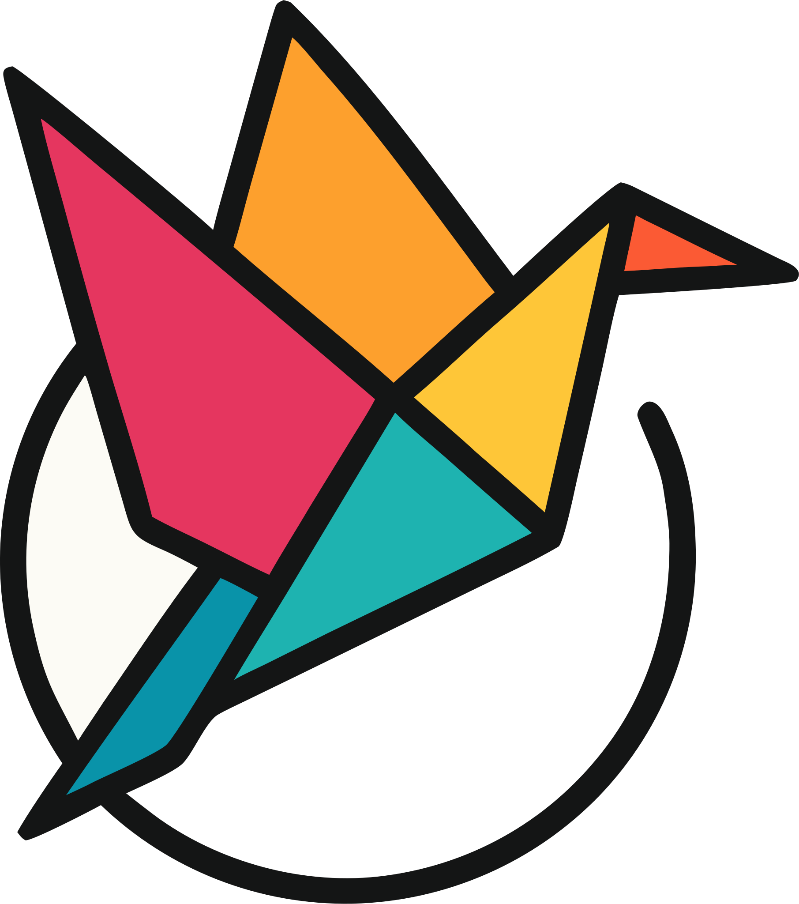
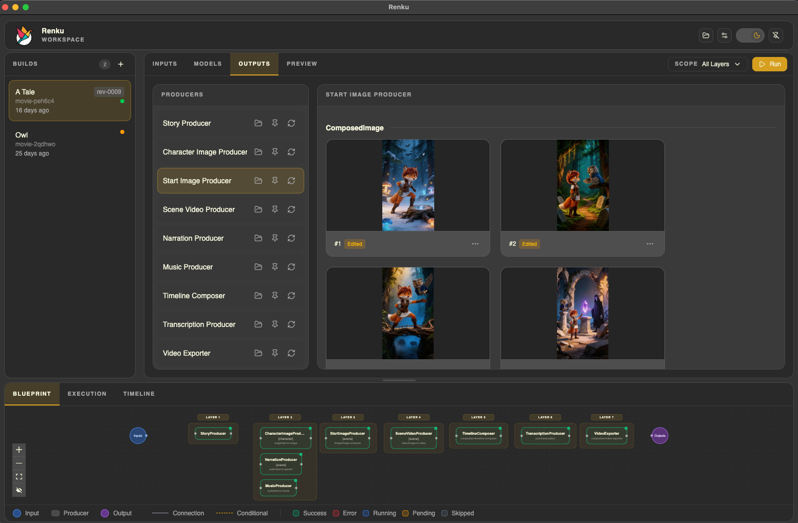

    
  <h1>Renku</h1>
  
<strong>AI-powered build system for video content generation</strong>

  
  
  

  **[Documentation](https://gorenku.com/docs/)** · **[Quick Start](https://gorenku.com/docs/app-quick-start/)** · **[Examples](./catalog)**

   

  

 

## What is Renku?

Renku is a powerful build system for generating video content using AI models. It enables you to create narrated documentaries, educational videos, social media reels from simple text prompts by orchestrating multiple AI providers (OpenAI, Replicate, fal.ai, ElevenLabs) into cohesive production pipelines.

Unlike monolithic AI video tools, Renku gives you fine-grained control over every step of the generation process through **blueprints** - declarative YAML workflows that define how content flows from text prompts to final rendered videos. The system handles dependency resolution, parallel execution, state tracking, and artifact versioning automatically, letting you focus on creative direction rather than infrastructure.

Key features include:

- **Multi-provider orchestration**: Mix and match AI services (text, image, audio, video) in a single workflow
- **Incremental generation**: Layer-by-layer execution with dirty checking - only regenerate what changed
- **State management**: Built-in manifest system tracks all artifacts and their dependencies
- **Parallel execution**: Automatic job parallelization within dependency layers
- **Local-first**: All artifacts stored locally with optional S3 cloud storage support
- **Video composition**: Uses ffmpeg for simple composition and subtitles. It also uses [Remotion](https://www.remotion.dev/) to compose preview videos inside the app with multiple tracks and segments per track from the AI generated artifacts.
- **MP4 export**: Exports your generated final video to MP4, so you can upload to anywhere you want.

## Packages

### Applications

- **[@gorenku/cli](./cli/README.md)** - Command-line interface for video generation

  The main user-facing tool. Install globally to start generating AI videos from your terminal. Includes workspace management, blueprint execution, and a built-in viewer for previewing results.

- **[renku-desktop](./desktop/README.md)** - Desktop application (macOS)

  Electron-based desktop app that wraps the CLI and viewer into a native macOS application. Packages the full Renku experience — generation, viewing, and workspace management — without requiring a terminal.

- **[@gorenku/web](./web/README.md)** - Documentation and marketing website

  The [gorenku.com](https://gorenku.com) website, built with Astro and Starlight. Hosts product documentation, quick-start guides, CLI reference, and blueprint authoring docs.

- **[viewer](./viewer/README.md)** - Blueprint workspace and generation IDE

  The primary graphical interface for Renku. Browse blueprints and catalog templates, manage builds, edit inputs and model selections, plan and run generation with real-time streaming logs, inspect and edit generated artifacts, and preview the final video with the Remotion Player. Bundled with the CLI (served via `renku viewer`) and embedded in the desktop app.

### Open-Source Libraries

- **[@gorenku/core](./core/README.md)** - Core workflow orchestration engine

  The foundation of Renku. Handles blueprint loading, execution planning, job orchestration, manifest management, and event logging. Use this package if you're building custom tooling on top of Renku.

- **[@gorenku/providers](./providers/README.md)** - AI provider integrations

  Integrations with OpenAI, Replicate, fal.ai, Wavespeed AI, and other AI services. Includes producer implementations, model catalogs, and a unified provider registry system.

- **[@gorenku/compositions](./compositions/README.md)** - Remotion video compositions

  Remotion-based video rendering components and timeline document format. Supports both browser and Node.js environments for video playback and export.

## Quick Start

For full installation and setup instructions, see the [Quick Start Guide](https://gorenku.com/docs/quick-start).

## Documentation

Full documentation is available at [gorenku.com](https://gorenku.com/):

- [Introduction](https://gorenku.com/docs/introduction) - Learn what Renku is and how it works
- [Quick Start Guide](https://gorenku.com/docs/quick-start) - Get up and running in minutes
- [CLI Reference](https://gorenku.com/docs/cli-reference) - Complete command documentation
- [Blueprint Authoring](https://gorenku.com/docs/blueprint-authoring) - Create custom workflows
- [Usage Guide](https://gorenku.com/docs/usage-guide) - Advanced features and tips

## Contributing

We are not yet open for contributions, but it will be coming very soon.

## License

This repository uses multiple licenses:

- **MIT License** — [`/core`](./core/LICENSE), [`/compositions`](./compositions/LICENSE), [`/providers`](./providers/LICENSE)
- **Renku Source-Available License** — [`/cli`](./cli/LICENSE), [`/viewer`](./viewer/LICENSE), [`/web`](./web/LICENSE), [`/desktop`](./desktop/LICENSE)

The Renku name, logos, icons, and brand assets are reserved trademarks. See [TRADEMARKS.md](./TRADEMARKS.md) for details.
