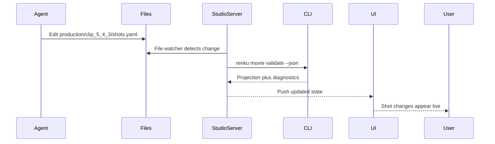

# Agent File Ownership And State Boundaries

Date: 2026-05-03

Status: proposal draft

## Core Decision

Renku Movie Studio should not treat "agents can edit files" as a blanket rule.

That sounds simple, but it becomes dangerous once the files include execution state, selected takes, approvals, run records, derived indexes, UI selection, locks, diagnostics, and artifact references.

The clearer rule is:

> Agents may directly edit authored intent.
>
> Agents may directly edit configurable execution intent.
>
> Agents must not directly edit system-owned state.
>
> System-owned state is changed only through Renku commands or Renku services.

The short version:

> Agents edit plans. Renku records facts.

This distinction should be treated as a core architectural boundary for the new Movie Studio.

## Why This Boundary Matters

The new Movie Studio is intended to be used with agent apps such as Codex and Claude Code. Those agents are good at reading and editing files. The project should use that strength.

However, not every file-backed value should be agent-editable.

Some files represent creative or production intent:

- the story structure,
- the narrative,
- shot descriptions,
- visual constraints,
- desired workflow,
- model selection,
- generation parameters.

These are valuable for agents to edit directly because they are the movie equivalent of source code.

Other files represent facts about the system:

- a run started,
- a run completed,
- a run failed,
- an artifact was produced,
- a take was approved,
- a take was selected,
- the UI is currently focused on a given scene or shot,
- a packet was compiled,
- diagnostics were generated.

These are not useful for agents to hand-edit. Direct edits here would create inconsistencies and force agents to manually maintain state transitions that Renku should own.

For example, changing this directly:

```yaml
approved: true
selectedRunId: run_002
```

looks simple, but it may also require updating:

- clip status,
- scene status,
- selected artifact links,
- downstream stale markers,
- timeline references,
- activity logs,
- validation diagnostics,
- artifact existence checks,
- approval attribution,
- timestamps.

There is little value in asking an agent to modify that YAML and then immediately run validation. The correct operation is a command:

```bash
renku movie approve --run run_002
```

That command can validate the transition and update every affected system-owned file atomically.

## Three Classes Of Files

Movie project files should be divided into three ownership classes.

```text
1. Authored intent files
   Safe for agents to edit directly.

2. Configurable execution intent files
   Usually safe for agents to edit directly, but always compiled and validated before use.

3. System-owned state files
   Not safe for agents to edit directly. Must be changed through Renku commands/services.
```

The key distinction is:

- **Intent** says what the user wants.
- **State** says what actually happened or what the system currently knows.

Agents are useful at editing intent.

Agents are risky when manually editing state.

## Class 1: Authored Intent Files

Authored intent files describe the creative target.

They are the closest equivalent to source files in a software project.

Examples:

```text
movie.yaml
narrative.md
characters.yaml
style.yaml
production/clip_5_4_3/brief.md
production/clip_5_4_3/shots.yaml
production/clip_5_4_3/prompt-notes.md
```

These should be safe for agents to edit directly.

If the user says:

> Mehmet II needs to be younger in this scene, wearing armor instead of the kaftan.

The agent should be able to update a shot file or character intent file directly.

Example:

```yaml
shots:
  - id: shot_2
    framing: close_up
    subject: cast_mehmed_ii
    visualIntent: Young Mehmed studies the cannon with controlled intensity.
    costume: Fifteenth-century Ottoman armor, not court robes.
```

This direct edit has value:

- the user can review the diff,
- Movie Studio can reflect the new intent,
- the next compiled packet can use the updated description,
- the agent does not need a tiny API call for every creative field.

### Authored Intent Rules

Agents may directly edit authored intent when the edit:

- changes descriptive content,
- adds or revises narrative context,
- changes prompt notes,
- changes shot descriptions,
- changes visual constraints,
- adds explicit references by declared ID,
- does not claim that any execution happened,
- does not update derived state.

Agents must still follow the repository-wide Renku rules:

- never infer relationships from names,
- never resolve references through aliases,
- never parse canonical IDs,
- never add fallback behavior to keep going,
- fail fast when a required binding or reference is missing.

## Class 2: Configurable Execution Intent Files

Configurable execution intent files describe how the next run should be prepared.

They do not say that a run happened. They only describe what should be used when Renku later compiles or executes a run.

Examples:

```text
production/clip_5_4_3/generation-config.yaml
production/clip_5_4_3/workflow.yaml
production/clip_5_4_3/model-selection.yaml
production/clip_5_4_3/generation-params.yaml
```

These are good candidates for direct agent edits because they avoid a large number of tiny command or API calls.

For example:

```yaml
kind: renku.clipGenerationConfig
version: 0.1.0

scope:
  clipId: clip_5_4_3
  shotId: shot_2

workflow:
  id: workflow_image_concept
  blueprint: catalog/blueprints/movie-production/image-concept.yaml

model:
  provider: openai
  id: gpt-image-2

parameters:
  count: 4
  aspectRatio: "16:9"
  resolution:
    width: 1920
    height: 1080
```

An agent can directly edit this file to change the desired model from Nano Banana to GPT-Image-2, increase candidate count, or adjust resolution.

But this direct edit must not be interpreted as execution state.

Changing `model.id` does not mean:

- a run started,
- a run completed,
- the old run was invalidated,
- a new take was selected,
- an artifact was produced.

It only means:

> The next compile or generate action should use this desired configuration.

The state transition still belongs to Renku:

```bash
renku movie compile --clip clip_5_4_3 --shot shot_2
renku movie generate --clip clip_5_4_3 --shot shot_2
```

### Configurable Execution Intent Rules

Agents may directly edit configurable execution intent when the edit:

- changes desired workflow selection,
- changes desired model selection,
- changes generation parameters,
- changes desired reference inputs,
- changes intended duration or resolution,
- changes candidate count,
- changes seed or variation settings,
- affects future compilation or execution only.

Agents must not use these files to claim:

- a packet has been compiled,
- a run exists,
- a run has started,
- a run has completed,
- a run has failed,
- an output has been approved,
- an artifact exists.

Those are system-owned facts.

## Class 3: System-Owned State Files

System-owned state files represent facts about the project, the UI, or execution.

Agents may read these files.

Agents must not directly edit them.

Examples:

```text
studio/selection.yaml
studio/activity.log.jsonl
studio/diagnostics.json

production/clip_5_4_3/.renku/packets/packet_001.yaml
production/clip_5_4_3/.renku/runs/run_001.yaml
production/clip_5_4_3/.renku/selected.yaml
production/clip_5_4_3/.renku/status.yaml

.renku/index.json
.renku/events.jsonl
.renku/locks/
```

These files should be changed only by Renku commands or Renku services.

Examples:

```bash
renku studio focus ...
renku movie compile ...
renku movie generate ...
renku movie regenerate ...
renku movie approve ...
renku movie reject ...
renku movie select ...
renku movie invalidate ...
```

### Why Agents Should Not Edit System State

System state encodes transitions and consistency.

For example, approving a take is not just a boolean change. It may need to check:

- does the run exist?
- did it finish successfully?
- are its artifacts present?
- does it belong to the selected clip or shot?
- is another run already selected?
- should approving this make downstream clips stale?
- should selected timeline references update?
- should an activity event be logged?
- should diagnostics be regenerated?

This is valuable logic. It should not be distributed across agents.

The correct command is:

```bash
renku movie approve --run run_002
```

The same applies to regeneration. An agent may edit the desired generation config, but the actual regeneration should be command-owned:

```bash
renku movie regenerate --clip clip_5_4_3 --shot shot_2
```

or:

```bash
renku movie generate --current
```

Regeneration creates facts:

- a compiled packet,
- a run record,
- artifacts,
- status changes,
- diagnostics,
- activity logs.

Those should be created by Renku.

## Proposed Project Layout With Ownership

Ownership should be visible in the project layout.

One possible layout:

```text
movie-project/
  movie.yaml                         # user/agent-authored intent
  narrative.md                       # user/agent-authored intent

  production/
    clip_5_4_3/
      brief.md                       # user/agent-authored intent
      shots.yaml                     # user/agent-authored intent
      generation-config.yaml         # user/agent-authored execution intent

      .renku/
        packets/
          packet_001.yaml            # system-owned compiled state
        runs/
          run_001.yaml               # system-owned runtime state
        selected.yaml                # system-owned selection/review state
        status.yaml                  # system-owned status projection

  studio/
    selection.yaml                   # Studio-owned current UI context
    diagnostics.json                 # Renku-owned validation diagnostics
```

Using `.renku/` inside production folders is one way to signal:

> This is machine-owned state. Read it, but do not casually edit it.

The exact folder names can change, but the ownership boundary should remain.

## Ownership Table

The architecture should explicitly document ownership for each file family.

| File or folder | Owner | Agent can edit directly? | How changes apply |
| --- | --- | --- | --- |
| `movie.yaml` | User/agent | Yes, with care | Project validation |
| `narrative.md` | User/agent | Yes | Project validation and context compilation |
| `characters.yaml` | User/agent | Yes | Project validation and context compilation |
| `style.yaml` | User/agent | Yes | Project validation and context compilation |
| `production/<clip>/brief.md` | User/agent | Yes | Clip context compilation |
| `production/<clip>/shots.yaml` | User/agent | Yes | Clip context compilation |
| `production/<clip>/prompt-notes.md` | User/agent | Yes | Clip context compilation |
| `production/<clip>/generation-config.yaml` | User/agent | Yes | Packet compilation |
| `production/<clip>/workflow.yaml` | User/agent | Yes | Packet compilation |
| `production/<clip>/model-selection.yaml` | User/agent | Yes | Packet compilation |
| `production/<clip>/.renku/packets/*.yaml` | Renku | No | Created by `renku movie compile` |
| `production/<clip>/.renku/runs/*.yaml` | Renku | No | Created and updated by generation commands |
| `production/<clip>/.renku/selected.yaml` | Renku | No | Changed by approve/select commands |
| `production/<clip>/.renku/status.yaml` | Renku | No | Rebuilt from state |
| `studio/selection.yaml` | Studio | No direct edit | Changed by Studio navigation or `renku studio focus` |
| `studio/activity.log.jsonl` | Renku/Studio | No | Appended by commands/services |
| `studio/diagnostics.json` | Renku | No | Created by validation |
| `.renku/index.json` | Renku | No | Rebuilt from source files |
| `.renku/events.jsonl` | Renku | No | Appended by commands/services |
| `.renku/locks/` | Renku | No | Managed by commands/services |

## `movie.yaml` Is Special

`movie.yaml` is authored intent, so agents should be allowed to edit it.

However, not all edits have the same risk.

Safe direct edits:

- edit a title,
- edit a short description,
- change a target duration,
- add a cast reference by exact declared ID,
- add or revise non-structural metadata.

Risky direct edits:

- rename an existing ID,
- delete a scene,
- delete a clip,
- move clips across scenes,
- split clips,
- merge clips,
- change IDs referenced by production folders or run state.

For risky structural operations, prefer commands:

```bash
renku movie scene add
renku movie clip add --scene scene_5_4
renku movie clip move --clip clip_5_4_3 --to-scene scene_5_5
renku movie id rename --clip clip_5_4_3 --to clip_5_4_3a
```

These commands can update references, validate the result, and avoid orphaned production folders or stale state.

The rule for `movie.yaml` should be:

> Agent-editable for descriptive intent.
>
> Command-preferred for structural refactors.

## `studio/selection.yaml` Is Readable Context, Not Agent-Owned State

Movie Studio needs to expose what the user is currently seeing so that agents can understand conversational references like:

> Make Shot 2 an extreme close-up.

The UI should publish this as explicit shared context.

Example:

```yaml
kind: renku.studioSelection
version: 0.1.0

updatedAt: "2026-05-03T14:22:31Z"

view:
  phase: clip_production
  screen: shots

scope:
  movieId: movie_constantinople_preparation
  sequenceId: seq_logistics
  sceneId: scene_5_4
  clipId: clip_5_4_3
  shotId: shot_2

visiblePanels:
  - structure
  - shot_definition
  - generations

selectedArtifacts:
  - production/clip_5_4_3/.renku/runs/run_002.yaml

userFocus:
  kind: shot
  id: shot_2
```

Agents should read this file.

Agents should not directly edit this file.

If an agent wants to move the user's focus, it should call a command:

```bash
renku studio focus --scene scene_5_4 --clip clip_5_4_3 --shot shot_2
```

The command or Studio service can then:

- validate the target exists,
- update selection state,
- scroll or navigate the UI,
- clear stale artifact selections,
- keep browser history and panel state consistent.

This makes `studio/selection.yaml` a shared context bridge, not an agent-owned scratchpad.

## Compile Analogy

The file ownership boundary should feel familiar to coding agents.

Source files:

```text
movie.yaml
narrative.md
production/<clip>/brief.md
production/<clip>/shots.yaml
production/<clip>/generation-config.yaml
```

Compiled outputs:

```text
production/<clip>/.renku/packets/*.yaml
.renku/index.json
studio/diagnostics.json
```

Runtime outputs:

```text
production/<clip>/.renku/runs/*.yaml
assets/generated/...
```

Selection/review state:

```text
production/<clip>/.renku/selected.yaml
production/<clip>/.renku/status.yaml
studio/selection.yaml
```

The rule:

> Agents can edit source files.
>
> Agents should not edit compiled outputs.
>
> Agents should not edit runtime state.
>
> Agents should not fake review or approval facts.

This is similar to:

- edit `src/*.ts`,
- do not hand-edit `dist/*.js`,
- run the compiler,
- do not fake test results.

## Command Surface

This boundary also clarifies which commands are worth building.

Renku does not need tiny commands for every creative field. Agents can directly edit authored intent files and configurable execution intent files.

Renku does need commands for state transitions.

Suggested core commands:

```bash
renku movie validate
renku movie compile --current
renku movie generate --current
renku movie regenerate --current
renku movie approve --current
renku movie reject --current
renku movie select --run run_002
renku studio focus --clip clip_5_4_3 --shot shot_2
```

Suggested structural commands:

```bash
renku movie scene add
renku movie clip add
renku movie clip move
renku movie id rename
```

Suggested generated-state commands:

```bash
renku movie invalidate --clip clip_5_4_3
renku movie mark-stale --clip clip_5_4_4 --reason upstream_reference_changed
renku movie task pause --task task_scene_5_4_visual_drafts
renku movie task resume --task task_scene_5_4_visual_drafts
```

The CLI should be compact but authoritative.

Its main job is not to replace file editing. Its job is to own operations where a change means:

- something happened,
- something was selected,
- something was approved,
- something was generated,
- something became stale,
- something moved structurally,
- something was validated or compiled.

## Live Studio Projection

Movie Studio should not own project state in a database.

It should run a local Studio server that watches the project folder and serves a validated projection to the UI.

Responsibilities:

- watch project files,
- debounce changes,
- run lightweight validation/indexing,
- maintain an in-memory projection for the UI,
- stream updates to the browser through WebSocket or Server-Sent Events,
- serve artifact previews,
- expose local endpoints for UI-triggered actions,
- call the same Renku services or command paths agents use.

Example flow:



If validation fails, the UI should still respond.

It should not pretend the project is valid. It should show:

- the last valid projection where possible,
- current diagnostics,
- invalid markers on affected scenes, clips, or shots,
- clear error messages explaining what must be fixed.

This gives the user grounding without making manual refresh necessary.

## Agent Loop Modes

The same ownership boundary supports conversational, assisted, and autonomous agent modes.

### Conversational Mode

User says:

> Mehmet II needs to be younger here, wearing armor instead of the kaftan.

Agent reads:

- `studio/selection.yaml`,
- selected clip files,
- selected shot files,
- `movie.yaml`,
- `narrative.md`,
- relevant character/style files.

Agent edits authored intent, then runs validation.

Movie Studio reflects the change live.

### Assisted Action Mode

User says:

> Great, regenerate this image with GPT-Image-2.

Agent may edit configurable execution intent:

```yaml
model:
  provider: openai
  id: gpt-image-2
```

Then it triggers a command-owned state transition:

```bash
renku movie regenerate --current
```

Movie Studio watches run state update:

```text
queued -> running -> produced -> needs_review
```

### Autonomous Batch Mode

User says:

> Generate rough visual drafts for all clips in Scene 5.4.

Agent may:

- edit production intent files,
- create or update generation configs,
- compile packets through Renku,
- launch generation through Renku,
- stop on validation errors,
- check for interrupts between steps.

Autonomous tasks should be represented as system-owned task state, not hidden agent memory.

Example:

```yaml
kind: renku.movieTask
version: 0.1.0

id: task_scene_5_4_visual_drafts
goal: Generate rough visual drafts for all clips in Scene 5.4.

scope:
  sceneId: scene_5_4

status: running

steps:
  - id: clip_5_4_1_image_draft
    status: done
  - id: clip_5_4_2_image_draft
    status: running
  - id: clip_5_4_3_image_draft
    status: pending

interruptPolicy:
  checkBeforePaidGeneration: true
  stopOnValidationError: true
```

This file should be system-owned and changed by task commands/services.

Agents can read it and act according to it.

## Interrupts

Interrupts should also be explicit and file-backed, but system-owned.

Example:

```text
studio/interrupts/interrupt_2026-05-03T1428.yaml
```

```yaml
kind: renku.userInterrupt
version: 0.1.0

createdAt: "2026-05-03T14:28:00Z"

scope:
  sceneId: scene_5_4
  clipId: clip_5_4_3
  shotId: shot_2

message: Mehmet II should be younger here, wearing armor instead of the kaftan.

status: open
```

Agents in autonomous mode should check for open interrupts between steps.

The UI or Renku service should create and resolve interrupt files.

Agents should not directly mark interrupts resolved unless they do so through a command:

```bash
renku movie interrupt resolve --id interrupt_2026-05-03T1428
```

## Validation Layers

Validation should be layered according to ownership.

### Layer 1: Structural Project Validation

Checks:

- `movie.yaml` shape is valid,
- sequence IDs are unique,
- scene IDs are unique,
- clip IDs are unique,
- references point to exact declared IDs,
- `narrativeFile` exists,
- clip references to cast IDs are valid,
- no relationships are inferred from names or numbering.

### Layer 2: Production Intent Validation

Checks:

- clip production files match schema,
- shot IDs are explicit,
- selected workflow exists,
- required workflow fields are present,
- model selection is valid for that workflow,
- reference files exist,
- exact declared IDs are used for referenced movie entities.

### Layer 3: Packet Compilation Validation

Checks:

- selected workflow/blueprint input contract is satisfied,
- all required inputs are explicitly bound,
- media producers have required `Duration`,
- artifact references exist,
- canonical IDs are passed end-to-end and never parsed,
- no alias lookup or "close enough" matching occurs.

### Layer 4: Dry-Run/Preflight

Checks:

- the run can be planned,
- inputs can be resolved,
- SDK payload can be built,
- no paid generation happens unless explicitly requested.

The UI can show simple user-facing states:

- valid,
- needs attention,
- ready to generate,
- running,
- generated,
- selected,
- stale.

Avoid a large status taxonomy until real product needs force it.

## UI Actions Should Use The Same State Transitions

Movie Studio should have buttons, but those buttons should map to the same underlying commands/services that agents use.

Examples:

- Regenerate
- Approve
- Reject
- Switch model
- Pin as reference
- Make variation
- Use as start frame

The app should not implement a private parallel state machine for these actions.

Conceptually:

```bash
renku movie regenerate --run run_002
renku movie approve --run run_003
renku movie model set --clip clip_5_4_3 --model gpt-image-2
```

This gives Renku one behavior surface:

- agent action,
- UI action,
- future MCP action,
- direct CLI action.

All should end up in the same core code path.

## MCP Is Optional Later

The initial architecture should prefer filesystem plus CLI over MCP.

Reasons:

- Codex and Claude Code are already strong at file edits,
- YAML and Markdown are inspectable,
- users can version-control the whole movie project,
- the CLI provides a stable and testable contract,
- this avoids designing an agent protocol too early.

An MCP can come later as a wrapper over the same operations.

If MCP arrives, it should expose:

- current selection,
- project projection,
- validation diagnostics,
- run actions,
- artifact previews.

But it should not introduce separate MCP-only behavior.

Internally it should still call the same Renku services used by CLI and Studio.

## Summary

The architecture should be explicit:

> Direct file edits are allowed only for declarative intent files whose meaning is local and whose changes do not imply that something has happened.
>
> Any file whose change means "something happened" is system-owned and must be modified only through Renku commands or services.

This preserves the benefits of file-backed agent collaboration while avoiding inconsistent state.

The practical rule:

- Agents can edit source-like project files.
- Agents can edit desired run configuration.
- Agents cannot edit compiled packets.
- Agents cannot edit run records.
- Agents cannot edit approvals.
- Agents cannot edit selected takes.
- Agents cannot edit UI focus directly.
- Agents cannot edit derived indexes, diagnostics, logs, or locks.

That boundary keeps Movie Studio simple, agent-friendly, and reliable.

