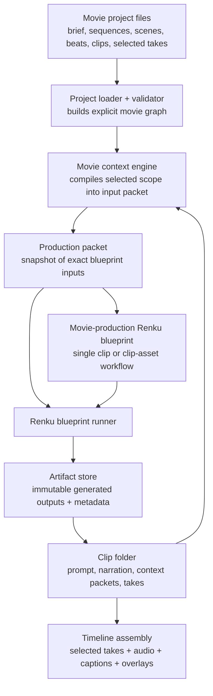
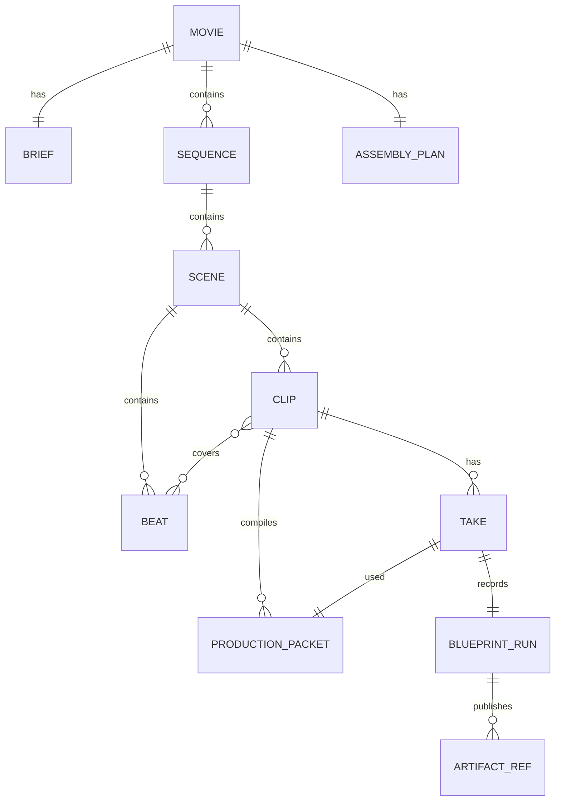
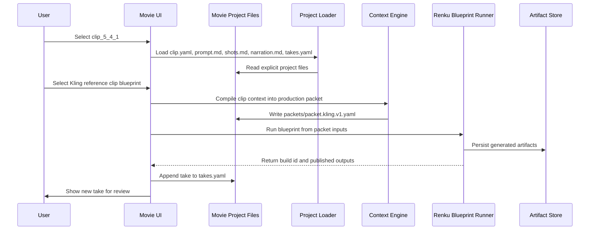

# ARCHIVED / MOSTLY OBSOLETE: Movie Definition And Blueprint-Based Production

> **Archive note, 2026-05-02**
>
> This document is being kept for reference only. Most of the architecture below is obsolete.
>
> The current direction is **not** to build narrative, timeline assembly, or production orchestration inside this app. Those stages will happen outside the app.
>
> The new target is much narrower:
>
> - a movie project folder,
> - a `movie.yaml` file that defines the movie hierarchy and cast,
> - a `narrative.md` file that provides authored story context,
> - no top-level Renku blueprint,
> - no movie-level blueprint orchestration layer,
> - no take/workflow registry/timeline assembly model in the movie YAML for now.
>
> See `movie-yaml-structure.md` in this folder for the newer proposal.

Date: 2026-05-01

Status: proposal draft

## Core Decision

The new movie production app should **not** model a full film as one top-level Renku blueprint.

It should also avoid inventing a second workflow system beside Renku.

Instead, it should use:

- a persisted **movie project folder** for narrative structure, prompts, clips, takes, and assembly decisions,
- a **movie context engine** that compiles narrative and production context into exact blueprint input packets,
- a new family of **movie-production Renku blueprints** designed for one clip or one clip-supporting asset task,
- standard Renku **blueprint inputs** for each concrete generation attempt,
- **take records** that connect one movie clip to one executed blueprint run,
- a shared **artifact store** as the durable record of generated media.

The movie layer answers:

> What are we making, which clip are we producing, and which take did we select?

The context engine answers:

> What exact story, continuity, character, style, and asset context should this one blueprint run receive?

The blueprint layer answers:

> How does this workflow run, what inputs does it require, and what outputs does it publish?

## Why Not One Expanded Blueprint?

A 20-30 minute movie can easily contain:

- 8-12 sequences,
- 40-100 scenes,
- 150-400 beats or clips,
- multiple takes per clip,
- different generation approaches for different clips,
- reusable casting assets, voices, maps, locations, style references, narration, music, and SFX.

Representing all of that as one expanded graph would make the system:

- **Huge**: hundreds or thousands of graph nodes before generation even starts.
- **Slow**: every planning/validation pass would need to reason about the whole film.
- **Rigid**: swapping a workflow for one clip would be awkward.
- **Unfriendly to iteration**: movie production involves rejected takes, alternate models, pinned references, and selective regeneration.
- **Too technical for the UI**: the primary app should show sequences, scenes, beats, clips, assets, and takes, not one enormous DAG.

The better model is:

> The movie project describes the production.  
> Blueprints describe reusable workflows.  
> Takes are concrete blueprint runs for a clip.

## Proposed Layers



The important boundary:

- The **movie project** is not a blueprint.
- A **clip** is not a blueprint.
- A **production packet** is not a blueprint; it is the compiled input snapshot for one run.
- A **take** is the record of running a blueprint for a clip.
- The **movie-production blueprint catalog** contains small Renku blueprints intended for one production unit at a time.

## Responsibilities

### Movie Project

The movie project should answer:

- What film are we making?
- What is the story brief?
- What are the sequences, scenes, beats, and clips?
- Which clips have selected takes?
- Which take contributes to the final timeline?
- Which project-level assets exist?
- Which external files or Renku artifacts are intentionally linked to the movie?

It should not answer:

- How every producer node inside every workflow is wired.
- How to expand clip production into a full Renku graph.
- How to infer artifact meaning from canonical ID naming.
- How to guess missing blueprint inputs.
- How to fall back when a blueprint input is missing.

### Movie Context Engine

The context engine is the bridge between narrative and production.

It should not generate media and it should not create a giant graph. Its job is to gather the relevant movie state for one selected production unit and compile it into the exact input contract of one chosen blueprint.

For a clip, the context engine gathers:

- movie-level brief, thesis, tone, format, language, aspect ratio, and resolution,
- sequence purpose and emotional function,
- scene purpose, emotional arc, location/time notes, and continuity notes,
- beat-level story change, viewer state, narration idea, and visual idea,
- clip-level production goal, target duration, prompt notes, shot notes, and narration text,
- relevant characters, voices, style references, locations, maps, and reusable visual anchors,
- previous and next clip context,
- selected previous take outputs when the chosen blueprint needs continuity inputs such as a start frame,
- the chosen blueprint's declared input contract.

The context engine then emits a **production packet**.

The production packet is important because it becomes the reproducible record of what actually drove a take. If the narrative changes later, old takes still point to the exact context packet that produced them.

This gives the app clear operations:

- regenerate a take with the same packet and a different model,
- regenerate a take with an updated packet and the same blueprint,
- mark a take stale because its source narrative changed,
- compare two takes that used different blueprints or different context packets.

### Production Packets

A production packet is a persisted, compiled input snapshot for one blueprint run.

It is not a blueprint. It does not define producers, graph edges, loops, or internal workflow behavior.

It should contain:

- the movie scope being produced,
- the chosen blueprint,
- the exact canonical or blueprint-facing inputs to pass into Renku,
- references to local files or selected take outputs that must be resolved before execution,
- the context sources used to compile the packet,
- a packet revision/hash so later UI can detect stale takes.

Example:

```yaml
kind: renku.movieProductionPacket
version: 0.1.0

id: packet_clip_5_4_1_seedance_v3

scope:
  kind: clip
  sequenceId: seq_logistics
  sceneId: scene_5_4
  beatIds:
    - beat_5_4_1
  clipId: clip_5_4_1

blueprint: catalog/blueprints/movie-production/clip-motion-seedance-reference/blueprint.yaml

context:
  movie:
    title: Preparation of the Siege of Constantinople
    format: historical_documentary
    tone: cinematic, sober, strategic
    style: grounded fifteenth-century historical realism

  sequence:
    title: The Logistics of Impossible Weight
    purpose: Show that the Ottoman war machine made the impossible physically movable.

  scene:
    title: The Cannon Begins to Move
    emotionalArc: Stillness -> strain -> movement -> awe -> dread

  beat:
    title: The Sleeping Monster
    storyChange: The viewer understands the cannon's impossible scale.
    viewerState:
      before: The cannon is only an idea or rumor.
      after: The cannon feels physically overwhelming and historically dangerous.

  clip:
    title: The Sleeping Monster
    targetDuration: 10
    productionGoal: Reveal the cannon as massive, inert, and threatening.
    narrationText: Before it could break the walls of Constantinople, the cannon had to defeat a simpler enemy: the road.
    visualObjective: Dawn near Edirne; workers reveal an enormous bronze bombard under canvas.
    mustInclude:
      - dawn near Edirne
      - canvas pulled from enormous bronze bombard
      - workers shown for scale
    mustAvoid:
      - modern tools
      - fantasy armor
      - the cannon already moving

  continuity:
    startState: Cannon is covered and inert.
    endState: Cannon has been revealed but has not moved.
    nextClip:
      clipId: clip_5_4_2
      requiredSetup: Workers begin preparing ropes, axles, timber, and oxen.

inputs:
  ClipContext:
    from: context
  Duration: 10
  Resolution:
    width: 1920
    height: 1080
  ReferenceImages:
    - source:
        kind: project_file
        path: assets/references/ottoman-documentary-style.png
```

The final `inputs` object must satisfy the selected blueprint's declared input contract. If it does not, validation should fail before any SDK call.

The packet may contain rich context, but the blueprint decides how to consume that context. For example, a Seedance blueprint may pass `ClipContext` to a prompt compiler, while a Ken Burns blueprint may use the same `ClipContext` to create still-image prompts, narration audio, and a motion plan.

### Movie-Production Renku Blueprints

Renku blueprints already represent workflows. The movie app should use that existing structure instead of creating a parallel `workflow` schema.

However, the new movie app needs a new set of blueprints that are intentionally designed for small production units. These are not top-level movie blueprints. They are normal Renku blueprints whose inputs are shaped around a compiled movie context packet.

Blueprints remain responsible for:

- declared inputs,
- loops and producer stages,
- exact input/output wiring,
- model/provider configuration,
- validation,
- published outputs.

Useful movie-production blueprints might include:

- **clip motion blueprints**:
  - text-to-video clip,
  - image-to-video clip,
  - reference-to-video clip,
  - start/end-frame clip,
  - multi-shot clip.
- **clip asset blueprints**:
  - Ken Burns still-image asset set,
  - map image or map animation asset,
  - reference stills,
  - storyboard/contact sheet,
  - continuity start/end frame generation.
- **audio blueprints**:
  - clip narration audio,
  - dialogue or voiceover,
  - music cue,
  - sound-design cue.
- **recurring asset blueprints**:
  - character portrait,
  - character sheet,
  - voice reference,
  - location reference,
  - style reference bundle.
- **assembly blueprints**:
  - scene assembly,
  - timeline fragment,
  - full render/export.

These are normal Renku blueprints. The only extra expectation is that their metadata should be good enough for the UI to present them as production options.

For example, a blueprint can expose this through existing or lightly extended `meta`:

```yaml
meta:
  name: Seedance Reference Clip
  id: SeedanceReferenceClip
  kind: movie-clip-workflow
  description: Generate one short cinematic video clip from compiled clip context and optional reference images.
  recommendedFor:
    - cinematic motion
    - reference-guided consistency
    - short multi-shot clip generation
```

The blueprint's declared inputs and outputs remain the source of truth.

A typical single-clip motion blueprint might declare:

```yaml
inputs:
  - name: ClipContext
    description: Compiled narrative, continuity, and visual context for one clip.
    type: json
    required: true
  - name: Duration
    description: Clip duration in seconds.
    type: int
    required: true
  - name: Resolution
    description: Output resolution.
    type: resolution
    required: true
  - name: ReferenceImages
    description: Optional reference images for style, character, location, or continuity.
    type: array
    itemType: image
    required: false

outputs:
  - name: ClipVideo
    description: Generated video for this clip take.
    type: video
  - name: LastFrame
    description: Final frame for continuity into later clips.
    type: image
  - name: PromptPackage
    description: Model-facing prompt package used for this take.
    type: json
```

A typical Ken Burns clip asset blueprint might declare:

```yaml
inputs:
  - name: ClipContext
    description: Compiled narrative, narration, and visual context for one clip.
    type: json
    required: true
  - name: NumImages
    description: Number of still images to generate for the clip.
    type: int
    required: true
  - name: Duration
    description: Clip duration in seconds.
    type: int
    required: true
  - name: Resolution
    description: Output resolution.
    type: resolution
    required: true
  - name: ReferenceImages
    description: Optional references for character, location, or style consistency.
    type: array
    itemType: image
    required: false

outputs:
  - name: StillImages
    description: Still images intended for Ken Burns-style assembly.
    type: array
    itemType: image
    countInput: NumImages
  - name: NarrationAudio
    description: Narration audio for this clip.
    type: audio
  - name: KenBurnsPlan
    description: Pan/zoom/order guidance for composing this clip.
    type: json
```

The exact input and output names can evolve, but the principle should stay fixed:

> Each movie-production blueprint receives one coherent context packet and produces one bounded production result.

## Important Constraint: No Canonical ID Parsing

The movie app may store exact Renku canonical IDs as opaque technical references, but it must never parse or derive meaning from them.

For example, this is acceptable:

```yaml
outputs:
  video:
    artifactId: "Artifact:VideoProducer.GeneratedVideo"
```

The movie app can say:

> This take's video output points to this exact Renku artifact.

But it must not say:

> The producer name is `VideoProducer` because I split the string after `Artifact:`.

Movie-level meaning must be stored explicitly:

```yaml
outputs:
  video:
    role: video
    artifactId: "Artifact:VideoProducer.GeneratedVideo"
  lastFrame:
    role: last_frame
    artifactId: "Artifact:VideoProducer.LastFrame"
```

The `role` is movie-app data.  
The `artifactId` is an opaque pointer into the Renku run.

## Project Folder Shape

The persisted format should be a folder hierarchy, not one large YAML file.

This keeps the project editable by AI agents and humans in the same way source code is editable:

- each sequence, scene, beat, clip, prompt, and take can be edited locally,
- Git diffs stay readable,
- agents can work on one scene or clip without touching the whole movie,
- generated run history does not pollute the stable narrative structure.

The root `movie.yaml` is a manifest. It identifies the project and points to the major indexes. It should not contain every scene, beat, prompt, take, and run.

```text
sample-project/
  movie.yaml
  brief.yaml

  cast/
    characters.yaml
    voices.yaml
    style-references.yaml

  assets/
    assets.yaml
    imported/
    references/

  sequences/
    sequence-index.yaml
    05-logistics/
      sequence.yaml
      scenes/
        scene-index.yaml
        04-cannon-begins-to-move/
          scene.yaml
          beats/
            beat-index.yaml
            01-sleeping-monster.yaml
          clips/
            clip-index.yaml
            01-sleeping-monster/
              clip.yaml
              prompt.md
              shots.md
              narration.md
              packets/
                packet.seedance.v1.yaml
                packet.kling.v1.yaml
                packet.ken-burns.v1.yaml
              takes.yaml
              assets/
                shot-sheet-v1.png

  assembly/
    timeline.yaml

  .renku/
    index.sqlite
    validation-report.json
```

Notes:

- `shots.md` is freeform text. It is not a structured shot database.
- `packets/*.yaml` files are compiled production packets for concrete blueprint runs.
- `takes.yaml` records runs and selected take.
- `assets/` inside a clip is only for clip-local files. Shared assets stay in the project-level `assets/` folder.
- `.renku/index.sqlite` is optional derived cache state, not source of truth.

## Root Manifest

The root manifest should stay small and stable.

```yaml
kind: renku.movieProject
version: 0.1.0

movie:
  id: movie_constantinople_preparation
  title: Preparation of the Siege of Constantinople
  format: historical_documentary
  targetDuration: 1500
  language: en
  aspectRatio: "16:9"
  resolution:
    width: 1920
    height: 1080

files:
  brief: brief.yaml
  sequences: sequences/sequence-index.yaml
  cast: cast/characters.yaml
  assets: assets/assets.yaml
  assembly: assembly/timeline.yaml
```

## Sequence And Scene Manifests

Indexes provide explicit ordering and path resolution. Folder names remain human-readable storage locations only.

```yaml
# sequences/sequence-index.yaml
sequences:
  - id: seq_logistics
    order: 5
    path: 05-logistics/sequence.yaml
```

```yaml
# sequences/05-logistics/sequence.yaml
id: seq_logistics
title: The Logistics of Impossible Weight
purpose: Show that the siege required transforming roads, labor, animals, and artillery into one moving system.
targetDuration: 240
scenes:
  index: scenes/scene-index.yaml
```

```yaml
# sequences/05-logistics/scenes/scene-index.yaml
scenes:
  - id: scene_5_4
    order: 4
    path: 04-cannon-begins-to-move/scene.yaml
```

```yaml
# sequences/05-logistics/scenes/04-cannon-begins-to-move/scene.yaml
id: scene_5_4
title: The Cannon Begins to Move
purpose: Show the moment the bombard stops being an invention and becomes a campaign.
emotionalArc: Stillness -> strain -> movement -> awe -> dread
beats:
  index: beats/beat-index.yaml
clips:
  index: clips/clip-index.yaml
```

The index and the target file both declare the ID. Validation should fail if they disagree.

## Beats And Clips

Beats stay on the narrative side. Clips stay on the production side.

A **beat** is a narrative unit of change:

- what the viewer learns,
- what the viewer feels,
- what story turn happens,
- what factual/thematic material must be preserved.

A **clip** is a production unit:

- which beat or beats it covers,
- what prompt/narration/shot-description files guide generation,
- which compiled production packets are available,
- which takes exist,
- which take is selected.

The default UI can start one beat as one clip, but the data model should not make that a law. A clip may cover one beat, part of a beat, or multiple beats.

### Beat File

```yaml
# sequences/05-logistics/scenes/04-cannon-begins-to-move/beats/beat-index.yaml
beats:
  - id: beat_5_4_1
    order: 1
    path: 01-sleeping-monster.yaml
```

```yaml
# sequences/05-logistics/scenes/04-cannon-begins-to-move/beats/01-sleeping-monster.yaml
id: beat_5_4_1
title: The Sleeping Monster
storyChange: The viewer understands the cannon's impossible scale.
targetDuration: 10
viewerState:
  before: The cannon is only an idea or rumor.
  after: The cannon feels physically overwhelming and historically dangerous.
narrationIdea: Before it could break the walls, the cannon had to defeat a simpler enemy: the road.
visualIdea: Dawn mist, canvas pulled back, bronze bombard revealed beside tiny workers.
```

The beat does not contain shot design, blueprint inputs, workflow selection, or take history.

### Clip Folder

```yaml
# sequences/05-logistics/scenes/04-cannon-begins-to-move/clips/clip-index.yaml
clips:
  - id: clip_5_4_1
    order: 1
    path: 01-sleeping-monster/clip.yaml
```

```yaml
# sequences/05-logistics/scenes/04-cannon-begins-to-move/clips/01-sleeping-monster/clip.yaml
id: clip_5_4_1
title: The Sleeping Monster
beatIds:
  - beat_5_4_1
target:
  duration: 10
  type: video
productionGoal: Create scale, weight, and dread in a short cinematic reveal.
files:
  prompt: prompt.md
  shots: shots.md
  narration: narration.md
  takes: takes.yaml
production:
  selectedPacket: packets/packet.seedance.v1.yaml
  packets:
    - packets/packet.seedance.v1.yaml
    - packets/packet.kling.v1.yaml
    - packets/packet.ken-burns.v1.yaml
```

The clip file deliberately stays small. It does not define a workflow. The production packet names the selected Renku blueprint and provides the exact compiled inputs for that run.

### Prompt, Shots, And Narration

Prompt and narration can be Markdown because they are authoring surfaces.

```markdown
<!-- prompt.md -->
Dawn near Edirne. Ottoman workers gather around a massive canvas-covered bombard.

The canvas is slowly pulled back, revealing an enormous bronze cannon. The camera emphasizes scale: workers look tiny beside the weapon. The atmosphere is cold, misty, and ominous.

Fifteenth-century Ottoman military camp. Cinematic historical documentary style. No modern tools, no modern clothing, no fantasy armor.
```

```markdown
<!-- shots.md -->
Three-shot structure:

1. Wide dawn reveal of the canvas-covered cannon outside Edirne.
2. Workers pull the canvas back, revealing the bronze bombard.
3. Low-angle view of the cannon mouth, with workers tiny beside it.

The clip should feel slow, heavy, and ominous. No fast cutting.
```

```markdown
<!-- narration.md -->
Before it could break the walls of Constantinople, the cannon had to defeat a simpler enemy: the road.
```

`shots.md` can guide:

- text-based multi-shot generation,
- a storyboard or contact-sheet image,
- a reference image workflow,
- or a human reviewing the clip plan.

It should stay plain text until the UI proves it needs more structure.

## Compiled Production Packets

Each packet should match the selected blueprint's declared input contract.

Packets can be generated by the context engine, edited by the user, or regenerated after narrative changes. Either way, the packet is the source of truth for a take's inputs.

For a Seedance/reference-video blueprint:

```yaml
# packets/packet.seedance.v1.yaml
kind: renku.movieProductionPacket
version: 0.1.0

id: packet_clip_5_4_1_seedance_v1
blueprint: catalog/blueprints/movie-production/clip-motion-seedance-reference/blueprint.yaml

scope:
  kind: clip
  clipId: clip_5_4_1
  beatIds:
    - beat_5_4_1

context:
  sourceFiles:
    - clip.yaml
    - prompt.md
    - shots.md
    - narration.md

inputs:
  ClipContext:
    title: The Sleeping Monster
    productionGoal: Create scale, weight, and dread in a short cinematic reveal.
    narrationText:
      file: narration.md
    prompt:
      file: prompt.md
    shotPlan:
      file: shots.md
    continuity:
      startState: Cannon is covered and inert.
      endState: Cannon has been revealed but has not yet moved.
  Duration: 10
  Resolution:
    width: 1920
    height: 1080
  ReferenceImages:
    - assets/shot-sheet-v1.png
    - ../../../../../../assets/references/ottoman-documentary-style.png
```

For a Kling/reference-video blueprint:

```yaml
# packets/packet.kling.v1.yaml
kind: renku.movieProductionPacket
version: 0.1.0

id: packet_clip_5_4_1_kling_v1
blueprint: catalog/blueprints/movie-production/clip-motion-kling-reference/blueprint.yaml

scope:
  kind: clip
  clipId: clip_5_4_1
  beatIds:
    - beat_5_4_1

inputs:
  ClipContext:
    title: The Sleeping Monster
    prompt:
      file: prompt.md
    shotPlan:
      file: shots.md
  Duration: 10
  ReferenceImages:
    - assets/shot-sheet-v1.png
  StartImage:
    fromTake:
      clipId: clip_5_4_0
      take: selected
      output: lastFrame
```

For a cheaper Ken Burns blueprint:

```yaml
# packets/packet.ken-burns.v1.yaml
kind: renku.movieProductionPacket
version: 0.1.0

id: packet_clip_5_4_1_ken_burns_v1
blueprint: catalog/blueprints/movie-production/clip-ken-burns-assets/blueprint.yaml

scope:
  kind: clip
  clipId: clip_5_4_1
  beatIds:
    - beat_5_4_1

inputs:
  ClipContext:
    title: The Sleeping Monster
    narrationText:
      file: narration.md
    motionPlan:
      file: shots.md
  Duration: 10
  NumImages: 3
  Images:
    - assets/cannon-wide.png
    - assets/cannon-detail.png
    - assets/workers-scale.png
```

These examples are intentionally simple. The exact fields must match real blueprint inputs. If the packet does not satisfy the blueprint contract, validation should fail before any SDK call.

## Takes Are Blueprint Runs

A take is one attempt to produce the clip using one Renku blueprint and one concrete production packet.

```yaml
# sequences/05-logistics/scenes/04-cannon-begins-to-move/clips/01-sleeping-monster/takes.yaml
selected: take_002

takes:
  - id: take_001
    status: rejected
    blueprint: catalog/blueprints/movie-production/clip-motion-seedance-reference/blueprint.yaml
    packet: packets/packet.seedance.v1.yaml
    buildId: build_2026_05_01_017
    outputs:
      video:
        role: video
        artifactId: "Artifact:VideoProducer.GeneratedVideo"
      lastFrame:
        role: last_frame
        artifactId: "Artifact:VideoProducer.LastFrame"
    notes: Good atmosphere, but the cannon wheels looked modern.

  - id: take_002
    status: selected
    blueprint: catalog/blueprints/movie-production/clip-motion-kling-reference/blueprint.yaml
    packet: packets/packet.kling.v1.yaml
    buildId: build_2026_05_01_023
    outputs:
      video:
        role: video
        artifactId: "Artifact:VideoProducer.GeneratedVideo"
      lastFrame:
        role: last_frame
        artifactId: "Artifact:VideoProducer.LastFrame"
    notes: Better scale and cleaner historical details.
```

This supports normal production behavior:

- Take 1 can use Seedance.
- Take 2 can use Kling.
- Take 3 can use a Ken Burns asset blueprint.
- The user selects the take that works best.

No whole-movie graph changes when a clip swaps blueprints.

The take should point to the packet, not directly to the current beat text. This is important because the narrative may change after the take is generated. The packet preserves what the blueprint actually received.

## Assembly

Assembly is movie-level structure. It references selected clip takes.

```yaml
# assembly/timeline.yaml
assembly:
  selectedTimeline:
    sequences:
      - sequenceId: seq_logistics
        scenes:
          - sceneId: scene_5_4
            clips:
              - clipId: clip_5_4_1
                selectedTakeId: take_002
```

Timeline assembly can later be implemented by a normal Renku composition/export blueprint. The movie-level file simply describes which takes should be used.

## Filesystem Identity Rules

Paths locate files. IDs define identity.

This means:

- folder names are for humans,
- explicit IDs are used for references,
- ordering is declared in index files,
- validation checks every index path and target ID,
- no behavior depends on parsing folder names,
- no behavior depends on parsing Renku canonical IDs.

For example, `sequences/05-logistics/` is only a storage path. The system should not infer that it is sequence five, or that its ID should be `seq_logistics`, from that folder name. The sequence file and index must declare those facts explicitly.

## Entity Model



## Orchestration Flow For A Clip



The app does not resolve an invented workflow registry. It resolves the blueprint named by the selected production packet and passes only inputs that satisfy that blueprint's declared contract.

## Required Failure Behavior

The loader, validator, or run preparation should fail fast when:

- an index points to a missing file,
- an index ID and target file ID disagree,
- a clip references a missing beat,
- `selected` in `takes.yaml` points to a missing take,
- a take references a missing production packet,
- a production packet references a missing blueprint,
- a production packet does not satisfy the blueprint's declared inputs,
- a production packet references a missing local file,
- `fromTake` points to a clip with no selected take,
- a referenced take output does not exist,
- a video or audio blueprint lacks an explicit `Duration` input or binding.

The system should not invent defaults or fallbacks to keep going. Missing data should surface as a validation error before generation.

## SQLite Consideration

SQLite is worth considering, but not as the canonical project format.

The recommended model is:

> Files are the source of truth.  
> SQLite is an optional derived index.

That means the app can delete and rebuild `.renku/index.sqlite` from the YAML and Markdown project files at any time.

SQLite becomes useful when the UI needs fast global queries, for example:

- Which clips are missing selected takes?
- Which takes used `catalog/blueprints/movie/seedance-reference-clip.yaml`?
- Which clips depend on a selected previous clip's last frame?
- Which artifact references point to missing takes?
- Which sequences are incomplete, failed, or ready for assembly?

The first implementation should probably skip SQLite and build an in-memory graph directly from the files. Add SQLite later when project load time, search, or cross-reference navigation becomes painful.

If introduced, SQLite should live under `.renku/`, should normally be ignored by Git, and should be treated like a cache:

```text
.renku/
  index.sqlite
  validation-report.json
```

The validator remains the authority. If files and SQLite disagree, the files win and the index should be rebuilt.

## Open Design Questions

- Should each clip have exactly one selected production packet, or should the selected take be the only source of truth?
- Should each clip keep multiple production packets, or should packets live only under takes once generated?
- Should packets use direct file paths only at first, or allow project-level reference IDs immediately?
- Should `shots.md` be fed into video generation directly, used to create a shot sheet image first, or both depending on the blueprint?
- Should generated storyboard sheets be treated as clip-local assets by default?
- Should beat files and clip files always be separate, or can a simple project embed initial clip intent inside the beat file?
- Should timeline assembly be a movie-level file first, then later exported through a composition blueprint?
- Which generated files should be committed, and which should live only in local `.renku/` or artifact storage?

## Recommended Starting Point

Start with a filesystem-first movie project:

- `movie.yaml` as a small root manifest,
- `brief.yaml` for the story brief,
- `sequences/sequence-index.yaml` for sequence order and paths,
- per-sequence `sequence.yaml` files,
- per-scene `scene.yaml` files,
- per-scene beat and clip indexes,
- beat YAML files for narrative turns,
- clip folders with:
  - `clip.yaml`,
  - `prompt.md`,
  - `shots.md`,
  - `narration.md`,
  - one or more compiled `packets/*.yaml` files,
  - `takes.yaml`,
  - optional local `assets/`,
- `assembly/timeline.yaml` for selected timeline structure.

The first implementation should include a strict project loader and validator. It should build one in-memory movie graph from the folder hierarchy and fail fast on broken references, duplicate IDs, missing files, mismatched index entries, missing blueprint inputs, or missing selected take outputs.

Only add SQLite once the file-based project model becomes slow or hard to query.
