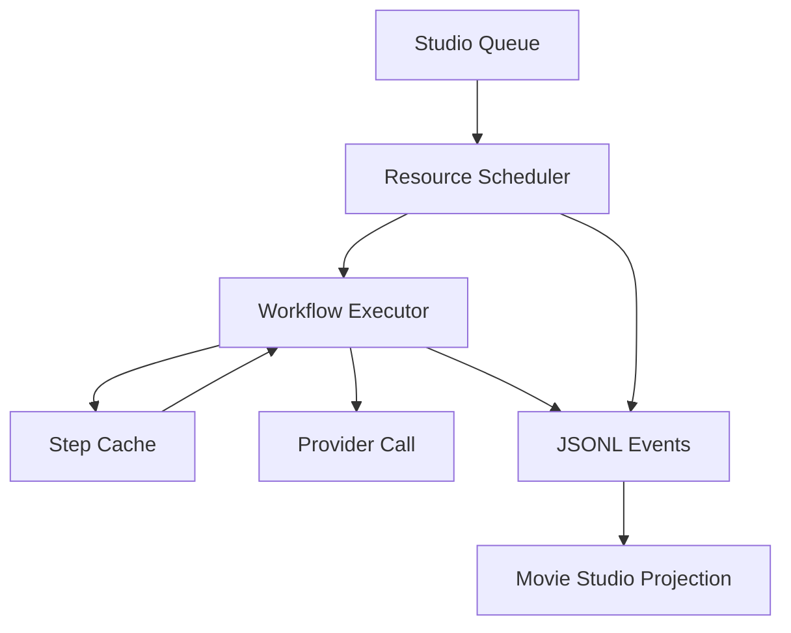

# Movie Studio Core, Micro-Workflows, And Queue Architecture

Date: 2026-05-03

Status: proposal draft

## Core Decision

Movie Studio should get a new domain core and a new CLI surface instead of continuing to evolve the existing `core` and `cli` packages into the foundation for the new app.

The current `core` and `cli` were built around the Viewer-era product model:

- a top-level Renku blueprint,
- an `inputs.yaml` file,
- graph expansion,
- planning,
- execution,
- build revisions,
- build folders,
- viewer-oriented artifact projection.

That model produced useful infrastructure, but it is not the right center of gravity for Movie Studio.

Movie Studio should instead be centered on:

- a file-backed movie project,
- movie structure,
- scene/clip/shot intent,
- long-running asynchronous generation tasks,
- generated candidates/takes,
- approval and selection state,
- a live Studio projection,
- direct collaboration with agent apps such as Codex and Claude Code.

The practical decision:

> Create a new Movie Studio domain core and a new Movie Studio CLI.
>
> Use a new Movie Studio micro-workflow YAML format.
>
> Build a lightweight workflow executor and durable queue for Movie Studio.
>
> Reuse or extract only the parts of the old system that solve concrete Movie Studio problems.
>
> Do not inherit the old blueprint parser, canonical expander, or global planner by default.

## Recommended Package Names

Recommended packages:

```text
movie-core/
  package: @gorenku/movie-core

movie-cli/
  package: @gorenku/movie-cli

movie-studio/
  package: @gorenku/movie-studio or movie-studio
```

The preferred name is `movie-core`, not `studio-core`.

Reason:

- the domain is the movie project,
- Movie Studio is one UI over that domain,
- agents and the CLI should interact with the same movie domain model without depending on the UI.

`@gorenku/movie-core` should own:

- `movie.yaml` schema and validation,
- narrative/project validation,
- scene/clip/shot model,
- production intent files,
- generation config files,
- micro-workflow schema,
- task state,
- step state,
- take records,
- approval/selection state,
- stale state,
- queue state,
- Studio projection model.

`@gorenku/movie-cli` should be the agent/human command surface over that domain.

`movie-studio` should be the desktop app and local server:

- project watcher,
- live projection,
- local UI action endpoints,
- queue supervisor,
- artifact previews,
- UI state/focus integration.

## Relationship To Existing `core` And `cli`

The existing `@gorenku/core` and `@gorenku/cli` should be treated as the current blueprint/build/viewer system.

They may continue serving the old Viewer workflow.

They should not define Movie Studio's product model.

Important historical concepts from the old system include:

- `movieId` as a build namespace,
- `builds/`,
- revisions,
- whole-blueprint execution,
- `renku generate`,
- viewer artifact projection,
- top-level blueprint orchestration.

Some of those concepts are useful internally, but they should not leak into Movie Studio as the primary domain language.

Movie Studio should speak in terms of:

- project,
- sequence,
- scene,
- clip,
- shot,
- task,
- workflow,
- step,
- candidate,
- take,
- selected output,
- stale state,
- queue state.

The old packages can donate reusable pieces, but reuse should be deliberate and scoped.

## Possible Future Runtime Extraction

If reuse becomes substantial, create a neutral runtime package later:

```text
runtime/
  package: @gorenku/runtime
```

This could hold product-neutral infrastructure:

- JSONL event log utilities,
- storage abstraction,
- blob/artifact storage,
- basic execution helpers,
- concurrency primitives,
- run/task lifecycle primitives,
- error helpers.

Do not start by extracting everything.

Start with `movie-core` and pull pieces only when Movie Studio has a concrete need.

This avoids turning a cleanup effort into a large speculative refactor.

## Honest Assessment Of Current Core, Providers, And CLI

### Current Providers Package

The providers package has strong reusable value.

It already contains:

- provider registry,
- model catalog lookup,
- model input schemas,
- schema-backed model configuration,
- SDK payload building,
- input compatibility checks,
- provider-specific adapters,
- OpenAI support,
- Replicate support,
- FAL support,
- Wavespeed support,
- ElevenLabs support,
- Vercel AI Gateway support,
- simulated/dry-run provider mode,
- artifact normalization,
- polling/retry helpers,
- internal media utilities such as subtitles, transcription, timeline, and FFmpeg/export pieces.

Models such as Kling, Seedance, GPT Image, ElevenLabs, and future video/audio providers have complex configuration surfaces:

- voice IDs,
- reference images,
- reference videos,
- audio inputs,
- shot-by-shot settings,
- model-specific options,
- provider-specific response formats,
- polling/recovery behavior.

Rebuilding this layer from scratch would not create product value.

Decision:

> Reuse the providers package or extract its provider/model/schema pieces into a shared package when needed.

### Current Core Package

Current `core` contains both useful runtime ideas and old blueprint/build complexity.

Useful ideas:

- JSONL event logs,
- storage abstraction,
- artifact/blob persistence,
- provider execution bridge,
- layered job execution,
- concurrency control,
- dry-run/simulated execution patterns,
- run lifecycle projection,
- error codes/helpers,
- artifact materialization,
- hashing for inputs/artifacts.

Complexity to avoid inheriting:

- old blueprint parser,
- canonical expander,
- canonical graph system,
- producer graph expansion for large blueprints,
- global planner,
- dirty propagation over a whole expanded graph,
- surgical regeneration planner,
- clip loop expansion,
- old build/revision model as the user-facing state,
- canonical IDs as the workflow authoring model,
- Viewer artifact projection as Movie Studio state.

Decision:

> Borrow concepts and small utilities from `core`.
>
> Do not reuse the old blueprint parser, canonical expander, or global planner as Movie Studio's architecture.

### Current CLI Package

The current CLI is oriented around the Viewer-era command shape:

```text
renku generate
  --blueprint
  --inputs
  --movie-id
  --dry-run
  --up-to-layer
  --regen
```

It resolves a blueprint and input file, plans a graph, commits a revision, executes layers, and writes build events.

This is useful for the old workflow, but it is too coarse and too old-model-specific for Movie Studio.

Movie Studio needs commands like:

```bash
renku movie validate
renku movie compile --current
renku movie generate --current
renku movie regenerate --current
renku movie approve --current
renku movie reject --current
renku studio focus --clip clip_5_4_3 --shot shot_2
renku movie queue list
renku movie queue pause
renku movie queue resume
```

Implementation-wise, these should belong in a new package such as `movie-cli`.

The new CLI may eventually be exposed as subcommands under a single `renku` binary, but package boundaries should remain clean.

Decision:

> Build a new Movie Studio CLI surface.
>
> Do not make Movie Studio depend on the current `renku generate` flow.

## Blueprint Decision

Movie Studio should not use existing blueprint YAML for micro-workflows.

It should define a new YAML format suitable for small, clip-local production workflows.

Reasons:

- the old blueprint parser and expander carry too much historical complexity,
- canonical expansion is brittle and not needed for small workflows,
- old blueprints were designed to model dependency graphs and expansion,
- movie-scale graph expansion does not fit 30-60 minute movies with hundreds of clips,
- the new app should avoid complexity creeping in just because it already exists,
- agents and users need a workflow format that matches the Movie Studio domain.

The chosen direction:

> Use a new Movie Studio micro-workflow YAML format.
>
> Do not reuse the old blueprint parser.
>
> Do not reuse the old canonical expander.
>
> Do not use blueprints to model a full movie.

## Why Not Movie-Scale Blueprints

The old blueprint system is useful for short generated pieces, for example:

- a one-minute clip,
- five to ten short generations stitched together,
- a small dependency graph,
- a concise model pipeline.

It does not scale well as the model for a 30-60 minute movie:

- hundreds of clips would create a giant dependency graph,
- validation and planning would become slow and hard to reason about,
- interaction would not match scene-by-scene and clip-by-clip creation,
- UI grounding would be poor,
- partial regeneration would be technically precise but product-confusing,
- the movie would become a graph problem instead of a production workflow.

Movie Studio should instead schedule many small tasks.

Bad model:

```text
one giant movie blueprint
  expands into hundreds or thousands of jobs
```

Good model:

```text
Movie Studio queue
  schedules many small clip/shot workflows
```

If a user wants to generate 200 clips, that should be:

```text
200 Studio tasks
```

not:

```text
one workflow that expands into 200 clip jobs
```

## Micro-Workflow Design Principle

Movie Studio workflows are execution recipes, not graph programs.

They should:

- describe one small production task,
- usually contain two to three stages,
- be easy to inspect,
- be easy for agents to edit or generate,
- have explicit inputs and dependencies,
- use typed outputs,
- support provider/model configuration,
- support local step reuse,
- avoid hidden expansion,
- avoid implicit loops,
- avoid movie-scale orchestration.

They should not:

- model a whole movie,
- own queue state,
- own approval state,
- own selected takes,
- own UI focus,
- expand into hundreds of jobs,
- depend on canonical ID parsing,
- infer relationships from names,
- use fallback bindings or "close enough" aliases.

## Example Micro-Workflow YAML

Example:

```yaml
kind: renku.movieWorkflow
version: 0.1.0

id: image_concept_with_prompt_enhancement
name: Image concept with prompt enhancement

inputs:
  clipContext:
    type: object
    required: true

  referenceImages:
    type: image[]
    required: false

steps:
  enhancePrompt:
    kind: llm
    model:
      provider: openai
      id: gpt-5-mini
    inputs:
      context: input.clipContext
    outputs:
      prompt:
        type: text

  generateImage:
    kind: image
    model:
      provider: openai
      id: gpt-image-2
    inputs:
      prompt: step.enhancePrompt.prompt
      references: input.referenceImages
    outputs:
      images:
        type: image[]
```

Important properties:

- step IDs are local to the workflow,
- dependencies are explicit,
- `input.*` means workflow input,
- `step.<stepId>.<outputId>` means a prior step output,
- no canonical ID parsing is required,
- no movie-scale expansion occurs,
- no implicit relationship is inferred from names.

## Workflow Execution Pipeline

For v1, the execution pipeline should be intentionally small:

```text
load workflow YAML
-> validate schema
-> resolve workflow inputs
-> resolve step dependencies
-> compute step input hashes
-> reuse satisfied steps when allowed
-> execute runnable steps subject to resource capacity
-> write task/step/artifact events
-> update Studio projection
```

This replaces the old planner/runner path for Movie Studio.

There may still be an executor and an internal scheduler, but not the old global planner.

The old planner answered:

> Given a large expanded graph and current build state, which jobs are dirty?

The new micro-workflow executor answers:

> Given this one task and this small workflow, which steps already have matching outputs and which steps still need to run?

That is a much smaller problem.

## Do We Need Planner -> Runner?

Not in the old sense.

Movie Studio should not start by importing the old planner/runner design wholesale.

For micro-workflows, a separate global planner is unnecessary.

The first version can use a simple local executor:

```text
for each topological layer:
  find steps whose dependencies are satisfied
  skip/reuse steps with matching previous successful outputs
  run ready steps when provider capacity allows
  stop or mark failure on errors according to task policy
```

The user intent is already scoped:

- current clip,
- current shot,
- selected workflow,
- requested regeneration action.

So if the user clicks:

> Regenerate this video

Movie Studio does not need to infer a surgical target across a giant graph.

It creates a task for the selected clip/shot and executes the selected workflow with the requested reuse policy.

## Dirty Tracking Is Still Needed

The new system should not be naive.

Even small workflows need local dirty tracking and reuse.

Example workflow:

```text
enhancePrompt
-> generateVideo
```

If the user changes only the reference image for video generation, the system should not rerun `enhancePrompt` if its inputs are unchanged.

Desired behavior:

```text
enhancePrompt: reused
generateVideo: rerun
```

This matters because:

- prompt enhancement can cost money,
- prompt enhancement adds latency,
- rerunning an LLM may change output unexpectedly,
- users often want controlled changes to only one part of a generation.

Decision:

> Movie Studio needs local step dirty tracking based on step input hashes.
>
> This dirty tracking is scoped to one micro-workflow and one task/scope.
>
> It is not the old global graph planner.

## Step Input Hashes

Each workflow step should compute a deterministic input hash.

Conceptually:

```text
stepInputHash = hash(
  workflow step definition,
  resolved step inputs,
  selected model,
  relevant model config,
  relevant generation parameters,
  upstream output references
)
```

If a prior successful step result exists for the same:

- workflow ID,
- step ID,
- scope,
- step input hash,

then the step can be reused, subject to the task's reuse policy.

Important:

- no fallback should be used if required inputs are missing,
- missing inputs should fail validation,
- malformed inputs should fail validation,
- no relationship should be inferred from file names or IDs,
- matching should use explicit metadata and hashes.

## Step Result Records

Step results are system-owned facts.

Agents may read them.

Agents should not directly edit them.

Example:

```yaml
kind: renku.workflowStepResult
version: 0.1.0

workflowId: video_from_prompt_and_reference
stepId: enhancePrompt

scope:
  clipId: clip_5_4_3
  shotId: shot_2

inputHash: sha256:abc123

status: completed

model:
  provider: openai
  id: gpt-5-mini

outputs:
  enhancedPrompt:
    type: text
    artifactRef: artifacts/art_789.json

createdAt: "2026-05-03T15:10:00Z"
```

When reused by a later task, the task event should make that explicit:

```json
{
  "type": "step-reused",
  "taskId": "task_456",
  "stepId": "enhancePrompt",
  "fromTaskId": "task_123",
  "inputHash": "sha256:abc123"
}
```

The UI can then say:

```text
Prompt enhancement reused from previous run.
```

This is better than silent reuse.

## Reuse Policy

Step reuse should be explicit and predictable.

Possible reuse modes:

```text
reuse_valid
  Reuse completed matching step outputs.

rerun_all
  Ignore prior step outputs and run all steps.

rerun_from_step
  Reuse upstream steps before the selected step.
  Rerun the selected step and downstream steps.

rerun_step_only
  Rerun only the selected step if valid.
  Fail if upstream/downstream context makes that invalid.
```

User-facing actions can map to these policies:

```text
"Regenerate video with same prompt"
  -> reuse prompt step, rerun video step

"Regenerate everything"
  -> rerun_all

"Change prompt and regenerate"
  -> prompt hash changes, downstream video hash changes

"Change reference image only"
  -> prompt step reused, video step reruns
```

The important rule:

> Reuse should be explainable in the UI and visible in events.

## Durable Asynchronous Queue

Movie Studio needs a durable asynchronous queue.

Generation is long-running:

- image generation can take seconds,
- video generation can take minutes,
- provider jobs may sit in remote queues,
- multiple clips may be in progress at the same time,
- users need to keep working while jobs run.

The queue should not mean a strict sequential execution order.

It should be a to-do task backlog:

```text
Task A: Generate video take for Clip 5.4.3 Shot 2
Task B: Generate image concepts for Clip 5.4.4
Task C: Generate narration audio for Scene 5.5
Task D: Enhance prompt for Clip 5.4.5
```

Tasks can start and complete in different orders depending on:

- priority,
- user focus,
- provider/model capacity,
- dependencies,
- estimated duration,
- cost class,
- task pause/cancel state,
- provider queue behavior.

Decision:

> Movie Studio needs a new queue.
>
> The queue is a durable task backlog, not a sequential pipeline.

## Queue Responsibilities

The Studio queue should:

- accept generation tasks from UI, CLI, or agents,
- persist task state to disk,
- survive app restart,
- run tasks in the background,
- allow users to continue navigating/editing,
- allow pause/resume/cancel,
- enforce provider/model concurrency limits,
- surface progress to the UI,
- support autonomous agent loops,
- support user interrupts,
- avoid starting expensive work when validation fails,
- keep task state and step state system-owned.

Queue state should be file-backed and event-backed.

Example task events:

```jsonl
{"type":"task-queued","taskId":"task_001","scope":{"clipId":"clip_5_4_3"}}
{"type":"task-started","taskId":"task_001"}
{"type":"step-reused","taskId":"task_001","stepId":"enhancePrompt"}
{"type":"step-started","taskId":"task_001","stepId":"generateVideo"}
{"type":"step-waiting-for-capacity","taskId":"task_001","stepId":"generateVideo","resource":"fal:kling-3.0"}
{"type":"step-completed","taskId":"task_001","stepId":"generateVideo"}
{"type":"task-completed","taskId":"task_001"}
```

## Task State And Step State

Movie Studio needs both task state and step state.

Task state is user-facing.

Example:

```yaml
kind: renku.movieTask
version: 0.1.0

id: task_123

scope:
  clipId: clip_5_4_3
  shotId: shot_2

goal: Generate a new video take.

workflowId: video_from_prompt_and_reference

status: running
```

Step state is runtime-facing.

Example:

```yaml
steps:
  enhancePrompt:
    status: reused
  generateVideo:
    status: running
```

Task statuses may include:

- queued,
- running,
- waiting_for_capacity,
- waiting_for_dependency,
- waiting_for_user,
- paused,
- cancelled,
- failed,
- completed.

Step statuses may include:

- pending,
- reusable,
- reused,
- queued,
- running,
- waiting_for_capacity,
- failed,
- completed,
- skipped.

These states should be owned by the Movie Studio services, not directly edited by agents.

## Provider And Model Concurrency

Provider/model concurrency limits must be first-class.

Some providers, especially video providers, have remote concurrency limits based on account level or spending:

- 2 jobs at a time,
- 5 jobs at a time,
- 10 jobs at a time,
- provider-specific rate limits,
- model-specific queues.

Movie Studio should not simply fire every queued task immediately.

It needs resource buckets.

Example:

```yaml
resources:
  openai:gpt-image-2:
    maxConcurrent: 3

  fal:kling-3.0:
    maxConcurrent: 2

  fal:seedance-2.0:
    maxConcurrent: 2

  elevenlabs:*:
    maxConcurrent: 4

  local:ffmpeg:
    maxConcurrent: 2
```

Each workflow step declares the model/provider it needs:

```yaml
steps:
  generateVideo:
    kind: video
    model:
      provider: fal
      id: kling-3.0
```

The scheduler only starts that step when the matching resource bucket has capacity.

Important:

> Capacity applies at the step level, not only the task level.

A task may be running but blocked because its next step is waiting for a `fal:kling-3.0` slot.

Meanwhile, the queue may still run faster image tasks using a different bucket.

## Scheduler Shape

The Movie Studio runtime should include:

```text
StudioQueue
  durable task backlog

ResourceScheduler
  provider/model concurrency buckets

WorkflowExecutor
  executes one task's micro-workflow

StepCache
  finds reusable completed step outputs

EventLog
  records task/step/artifact facts

StudioProjection
  turns events and files into UI state
```

Diagram:



This is still intentionally smaller than the old blueprint planner.

It handles the real Movie Studio requirements:

- long-running work,
- background execution,
- provider capacity,
- local step reuse,
- live progress,
- non-blocking UI.

It does not try to solve movie-scale graph planning.

## Suggested Queue Scheduling Rules

Initial scheduling can be simple:

- validate task before queueing or before first execution,
- do not start tasks whose required intent/config is invalid,
- prefer tasks in the current user focus when priorities are equal,
- do not exceed global max active tasks,
- do not exceed resource bucket capacity,
- run ready steps whose dependencies are satisfied,
- reuse matching step outputs before requesting provider capacity,
- stop a task on step failure unless task policy allows continuation,
- check for user interrupts between steps,
- check pause/cancel state before starting each paid provider call.

Possible future additions:

- estimated cost priority,
- estimated duration priority,
- manual task priority,
- per-scene queue groups,
- batch/autonomous task grouping,
- provider health/backoff,
- remote provider queue polling persistence.

Do not add these before they are needed.

## Provider Calls And Long-Running Remote Jobs

Video models may run for minutes.

The runtime should treat remote generation as long-running step execution.

For providers such as FAL, Kling, Seedance, or similar services:

- submit the job,
- persist provider request/job ID,
- poll or subscribe for status,
- write progress events,
- survive app restart if possible,
- materialize output artifacts when complete,
- mark step failed with provider diagnostics on failure.

This requires step state to preserve provider-specific execution metadata.

Example:

```yaml
providerRun:
  provider: fal
  model: kling-3.0
  requestId: fal_req_abc123
  status: submitted
  submittedAt: "2026-05-03T16:12:00Z"
```

Agents should not edit this directly.

It is system-owned state.

## Where Existing Infrastructure Can Help

Reuse or extract when concrete:

- provider registry,
- model catalog,
- model schema loading,
- provider adapters,
- SDK payload builder,
- schema validation,
- simulated provider mode,
- JSONL event log implementation,
- storage/blob helpers,
- artifact materialization ideas,
- hashing helpers,
- error code patterns,
- provider polling/retry code,
- FFmpeg/transcription/subtitle internal producers if useful.

Avoid by default:

- old blueprint parser,
- canonical expander,
- producer graph builder,
- global planner,
- dirty propagation over expanded graph,
- surgical regeneration planner,
- current `renku generate` command flow,
- build/revision terminology in the UI,
- viewer artifact projection as primary Studio state.

## How Movie Studio Uses Providers Without Old Blueprints

The new micro-workflow executor can still call the provider layer directly.

Conceptual flow:

```text
workflow step
-> model/provider descriptor
-> resolved step inputs
-> model schema and mapping
-> provider payload
-> provider invocation
-> normalized outputs
-> artifact records
```

This means Movie Studio does not need old blueprints to get value from providers.

The micro-workflow schema should define the provider/model and step inputs explicitly.

Then the executor can use provider/model schema utilities to build and validate payloads.

## CLI Direction

The new Movie Studio CLI should be command-oriented around the new domain.

Possible command surface:

```bash
renku movie validate
renku movie project init
renku movie focus --clip clip_5_4_3 --shot shot_2
renku movie workflow validate workflows/image-concept.yaml
renku movie task queue --current --workflow video_from_reference
renku movie task list
renku movie task pause task_123
renku movie task resume task_123
renku movie task cancel task_123
renku movie generate --current
renku movie regenerate --current
renku movie approve --current
renku movie reject --current
```

Implementation should live in `movie-cli`.

Whether it is ultimately exposed as `renku movie ...` or a separate binary is a packaging decision.

The important point:

> The new CLI should call `@gorenku/movie-core`.
>
> It should not be an extension of the old `renku generate` flow.

## UI Direction Implied By This Architecture

Movie Studio can stay simple because execution complexity lives behind task state and projections.

The UI should show:

- current scene/clip/shot,
- relevant production intent,
- generated candidates/takes,
- task queue/progress,
- reusable step explanations,
- approval/rejection/selection actions,
- warnings/validation diagnostics.

It should not expose:

- old blueprint graph nodes,
- canonical IDs,
- build revisions,
- full execution plans,
- provider payload internals,
- queue scheduling internals.

Advanced debug views can exist later, but they should not define the primary UX.

## Final Architecture Decision

Movie Studio will introduce:

- a new `@gorenku/movie-core`,
- a new `@gorenku/movie-cli`,
- a new Movie Studio micro-workflow YAML format,
- a lightweight workflow executor,
- local step dirty tracking based on explicit input hashes,
- a durable asynchronous task queue,
- provider/model resource buckets,
- JSONL task/step/artifact event logs,
- a live Studio projection.

Movie Studio will not reuse:

- the old blueprint parser,
- the old canonical expander,
- the old global planner,
- movie-scale blueprint expansion,
- current CLI command semantics as its backend,
- old build/revision language as the product model.

Movie Studio may reuse or extract:

- provider/model registry,
- model schemas,
- SDK payload validation,
- provider adapters,
- simulated execution,
- JSONL event log utilities,
- storage/blob helpers,
- hashing helpers,
- provider polling/retry code,
- internal media utilities where useful.

The guiding principle:

> Keep the new Movie Studio core small and domain-shaped.
>
> Borrow proven infrastructure only when it directly serves Movie Studio.
>
> Do not let old blueprint/build complexity creep in just because it already exists.

