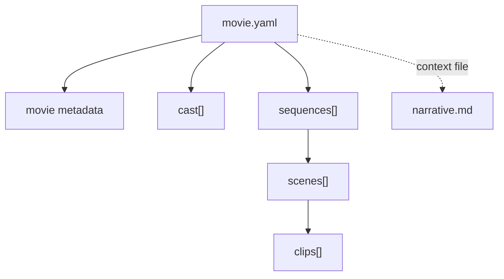

# Movie YAML Structure

Date: 2026-05-02

Status: proposal draft

## Current Direction

The app should treat a movie as a folder with two primary authored files:

```text
movie-project/
  movie.yaml
  narrative.md
```

The responsibility split is:

- `movie.yaml` defines the **machine-readable movie structure**.
- `narrative.md` provides the **human-authored story context**.

The YAML file should not try to become the narrative document. It should not contain long prose, full treatments, production notes, timeline decisions, workflow runs, takes, or blueprint execution state.

For now, the YAML should represent:

- movie metadata,
- cast,
- sequence hierarchy,
- scene hierarchy,
- clip hierarchy.

The app can use `narrative.md` as context when it needs the richer story explanation.

## Non-Goals

This spec intentionally does **not** define:

- a top-level Renku blueprint,
- blueprint orchestration,
- workflow selection,
- generation attempts,
- takes,
- production status,
- timeline assembly,
- selected renders,
- artifact store links,
- prompt packages,
- beat sheets.

Those may exist elsewhere later, but they should not be part of this first `movie.yaml` shape.

## Folder Contract

Recommended folder layout:

```text
constantinople-movie/
  movie.yaml
  narrative.md
  references/
    optional-reference-files.md
    optional-images/
```

Required files:

- `movie.yaml`
- `narrative.md`

Optional supporting folders can exist, but the core app should not require them for loading the movie structure.

## Design Principles

- Keep `movie.yaml` structural and compact.
- Put authored explanatory text in `narrative.md`.
- Use explicit IDs for movie entities.
- Do not infer relationships from names, numbering, or title text.
- Do not parse Renku canonical IDs here. This file is not a Renku graph or run manifest.
- Keep clips directly under scenes. Do not model beats in this version.
- Allow a clip to reference cast members explicitly by ID.
- Prefer short labels and structural summaries in YAML. Story explanation belongs in `narrative.md`.
- If a YAML entity needs to point to a section of `narrative.md`, use an explicit `narrativeRef`; do not infer the link from titles.

## Entity Hierarchy



## Required Top-Level Shape

```yaml
kind: renku.movie
version: 0.1.0

movie:
  id: movie_constantinople_preparation
  title: Preparation of the Siege of Constantinople
  format: historical_documentary
  language: en
  targetDurationSeconds: 1500
  narrativeFile: narrative.md

cast: []

sequences: []
```

## Field Notes

### `kind`

Required.

Identifies the file as a Renku movie definition.

```yaml
kind: renku.movie
```

### `version`

Required.

Schema version for this movie YAML shape.

```yaml
version: 0.1.0
```

### `movie`

Required.

Basic metadata for the whole movie.

```yaml
movie:
  id: movie_constantinople_preparation
  title: Preparation of the Siege of Constantinople
  format: historical_documentary
  language: en
  targetDurationSeconds: 1500
  narrativeFile: narrative.md
```

Recommended fields:

- `id`: stable movie ID.
- `title`: display title.
- `format`: broad format, such as `historical_documentary`, `fiction_short`, `explainer`, or `essay_film`.
- `language`: primary language code.
- `targetDurationSeconds`: intended total duration.
- `narrativeFile`: path to the authored markdown context file, relative to the movie folder.

Optional fields:

```yaml
movie:
  aspectRatio: "16:9"
  resolution:
    width: 1920
    height: 1080
  logline: A documentary about how Mehmed II prepared the machine that made Constantinople vulnerable before April 1453.
  narrativeRef: "#film-overview"
```

### `cast`

Required. Can be an empty array.

Represents recurring people, narrators, characters, groups, institutions, places, or entities that clips can reference.

For documentaries, "cast" should be understood broadly. It can include:

- historical figures,
- narrators,
- recurring experts,
- armies,
- cities,
- buildings,
- symbolic entities,
- maps or recurring visual subjects.

Example:

```yaml
cast:
  - id: cast_mehmed_ii
    name: Mehmed II
    kind: historical_figure
    role: protagonist
    shortDescription: Young Ottoman sultan preparing to take Constantinople.

  - id: cast_constantine_xi
    name: Constantine XI Palaiologos
    kind: historical_figure
    role: opposing_ruler
    shortDescription: Byzantine emperor defending the city.

  - id: cast_narrator
    name: Narrator
    kind: narrator
    role: voiceover
    shortDescription: Authoritative documentary narrator.

  - id: cast_theodosian_walls
    name: Theodosian Walls
    kind: location
    role: recurring_subject
    shortDescription: Ancient land walls guarding Constantinople.
```

Recommended cast fields:

- `id`: stable cast ID.
- `name`: display name.
- `kind`: what type of cast entry this is.
- `role`: story role.
- `shortDescription`: compact context for the app.

Optional cast fields:

```yaml
visualDescription: Fifteenth-century Ottoman ruler, young but controlled, austere court presence.
voiceDescription: Calm, grave, historically grounded documentary voice.
aliases:
  - Mehmed the Conqueror
  - Mehmed II
```

Use `aliases` only as display/search metadata. Do not use aliases to resolve references. References should use exact `id` values.

### `sequences`

Required. Can be an empty array while the movie is being drafted, but a usable movie should contain at least one sequence.

Sequences are the largest story sections.

```yaml
sequences:
  - id: seq_logistics
    number: 5
    title: The Logistics of Impossible Weight
    shortTitle: Logistics
    targetDurationSeconds: 240
    summary: The Ottoman war machine makes the impossible physically movable.
    scenes: []
```

Recommended sequence fields:

- `id`: stable sequence ID.
- `number`: explicit display/order number.
- `title`: full title.
- `shortTitle`: compact title for navigation.
- `targetDurationSeconds`: intended duration.
- `summary`: short structural summary.
- `scenes`: ordered list of scenes.

Ordering should come from array position or explicit `number`. The app should not infer ordering from IDs.

### `scenes`

Scenes live inside sequences.

```yaml
scenes:
  - id: scene_5_4
    title: The Cannon Begins to Move
    summary: The bombard stops being an invention and becomes a campaign.
    clips: []
```

Recommended scene fields:

- `id`: stable scene ID.
- `title`: display title.
- `summary`: compact scene summary.
- `clips`: ordered list of clips.

### `clips`

Clips live inside scenes.

Clips are the smallest first-class structural unit in this spec. There is no `beats` level in this version.

```yaml
clips:
  - id: clip_5_4_1
    title: The Sleeping Monster
    summary: The viewer understands the cannon's impossible scale.
```

Recommended clip fields:

- `id`: stable clip ID.
- `title`: display title.
- `summary`: short purpose or action of the clip.

## Complete Example

```yaml
kind: renku.movie
version: 0.1.0

movie:
  id: movie_constantinople_preparation
  title: Preparation of the Siege of Constantinople
  format: historical_documentary
  language: en
  targetDurationSeconds: 1500
  aspectRatio: "16:9"
  resolution:
    width: 1920
    height: 1080
  narrativeFile: narrative.md
  logline: A historical documentary about how Mehmed II prepared the strategic, logistical, and psychological machine that made Constantinople vulnerable before April 1453.

cast:
  - id: cast_mehmed_ii
    name: Mehmed II
    kind: historical_figure
    role: protagonist
    shortDescription: Young Ottoman sultan preparing to take Constantinople.
    aliases:
      - Mehmed the Conqueror

  - id: cast_constantine_xi
    name: Constantine XI Palaiologos
    kind: historical_figure
    role: opposing_ruler
    shortDescription: Byzantine emperor defending the city.

  - id: cast_theodosian_walls
    name: Theodosian Walls
    kind: location
    role: recurring_subject
    shortDescription: Ancient land walls guarding Constantinople from the west.

  - id: cast_urban
    name: Urban
    kind: historical_figure
    role: engineer
    shortDescription: Cannon founder associated with Mehmed's giant bombard.

  - id: cast_narrator
    name: Narrator
    kind: narrator
    role: voiceover
    shortDescription: Grave, cinematic documentary narrator.

sequences:
  - id: seq_ambition
    title: The Young Sultan's Obsession
    shortTitle: Ambition
    summary: Mehmed inherits an old imperial dream and turns it into policy.
    scenes:
      - id: scene_1_1
        title: A Throne Facing an Ancient City
        summary: The film establishes Mehmed's accession and Constantinople's symbolic weight.
        clips:
          - id: clip_1_1_1
            title: The New Sultan
            summary: Mehmed is introduced as young, controlled, and intensely focused.
          - id: clip_1_1_2
            title: The City Across the Water
            summary: Constantinople appears as both prize and obstacle.
  - id: seq_logistics
    title: The Logistics of Impossible Weight
    shortTitle: Logistics
    summary: The Ottoman war machine makes the impossible physically movable.
    scenes:
      - id: scene_5_4
        title: The Cannon Begins to Move
        summary: The bombard stops being an invention and becomes a campaign.
        clips:
          - id: clip_5_4_1
            title: The Sleeping Monster
            summary: The viewer understands the cannon's impossible scale.
          - id: clip_5_4_2
            title: Ropes, Axles, Timber
            summary: Preparation becomes organized labor.
          - id: clip_5_4_3
            title: The Weight Refuses
```

## Suggested Validation Rules

The loader should fail when:

- `kind` is not `renku.movie`,
- `version` is missing or unsupported,
- `movie.narrativeFile` is missing,
- the referenced `narrative.md` file does not exist,
- any `id` is duplicated within the movie file,
- a sequence is missing `scenes`,
- a scene is missing `clips`,
- a required duration field is missing where the app depends on it.

The loader should not:

- infer cast references from names,
- infer ordering from IDs,
- resolve aliases as IDs,
- synthesize missing clips,
- silently create missing cast entries,
- parse any ID to derive hierarchy.

## Open Questions

- Should the app support multiple markdown context files later, such as `narrative.md`, `research.md`, and `style.md`?

## Recommendation For V0

For V0, keep the file boring and strict:

- required `movie`,
- required `cast`,
- required `sequences`,
- required nested `scenes`,
- required nested `clips`,
- required IDs everywhere,
- `narrative.md` as the main prose context.

This gives the app a stable structural map without pulling production, prompting, or timeline logic back into the schema too early.
