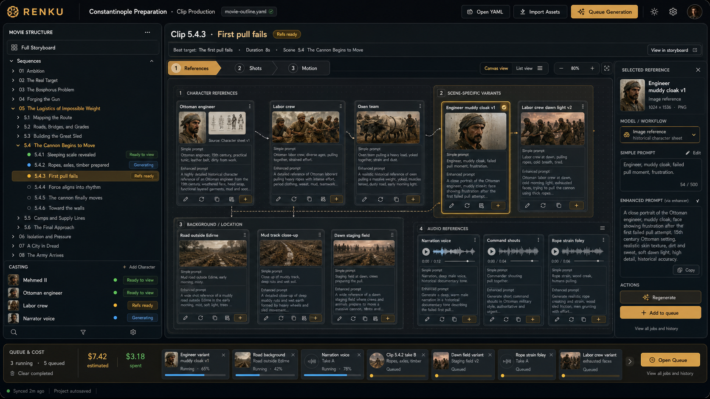
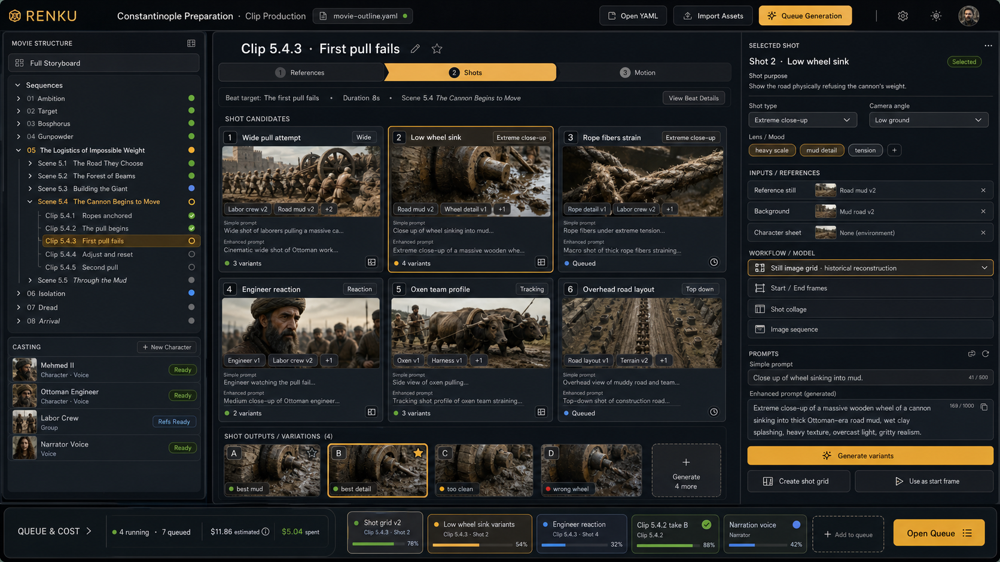
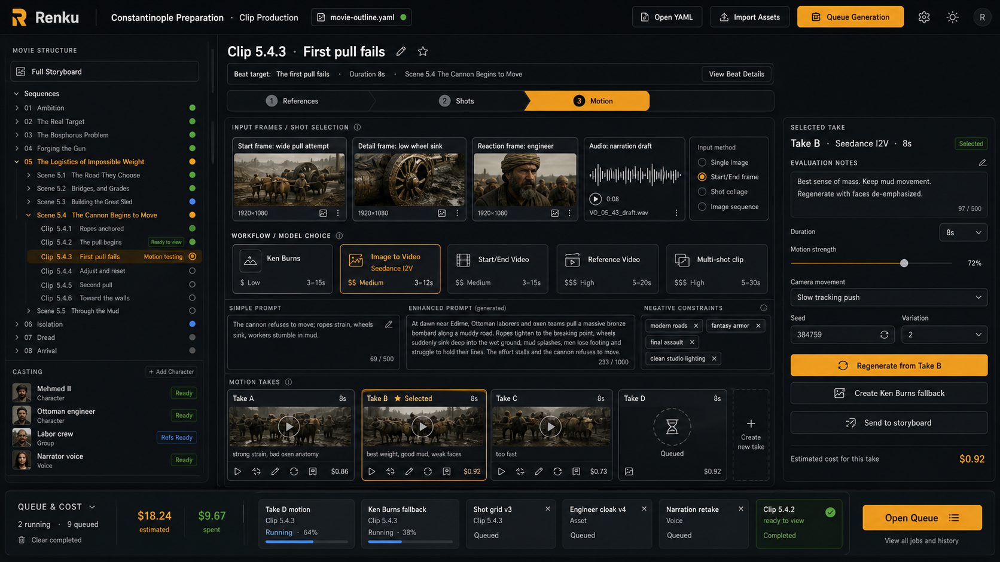
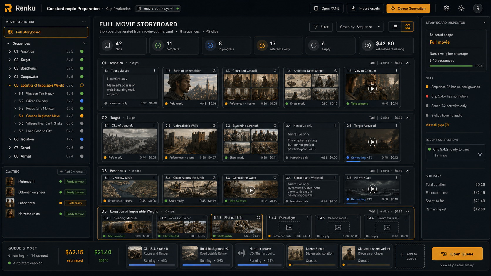
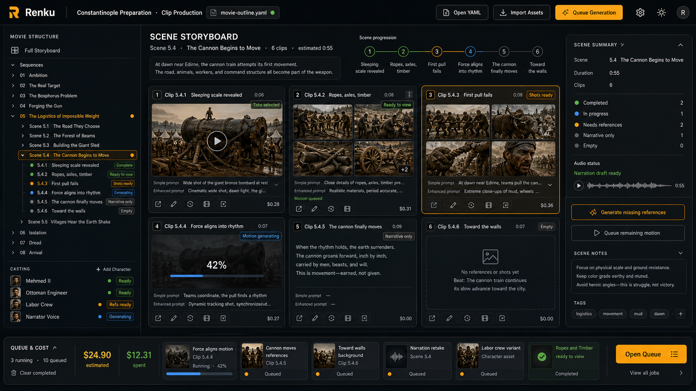

# Clip Production Focused App Visual Design

Date: 2026-05-02

This note captures a revised direction for the new Renku movie production app.

The app should focus only on **Clip Production**. Story brief and narrative authoring happen outside this tool. The user brings Renku a structured movie outline, and Renku becomes the visual production workspace for casting, references, shots, motion takes, storyboards, queues, and cost visibility.

## Product Focus

The app starts from an authored YAML file.

That YAML contains the creative structure:

- story brief,
- narrative spine,
- sequence outline,
- scenes,
- beats.

Renku should open that YAML and turn it into a production workspace.

The app should help the user:

- navigate the movie hierarchy,
- create and manage cast assets,
- design references for each clip,
- design shots for each clip,
- create motion takes from selected references and shots,
- inspect simple and enhanced prompts for every generated artifact,
- keep working while long-running generations continue in a shared queue,
- understand estimated and final generation spend at all times,
- see the overall movie storyboard as clips move from empty text to images, shots, and motion.

The app should not expose a high-level workflow rail such as Story Brief, Narrative, Casting, Clip Production, Timeline Assembly. That structure is no longer the main navigation model for this focused tool.

## Core Layout

The proposed app shell has three persistent areas:

1. **Left navigation panel**
   - Movie hierarchy from the input YAML.
   - Casting section with cast characters.
   - Readiness and ready-to-view indicators.

2. **Main detail area**
   - Changes based on the selected hierarchy item.
   - Top-level selections show story and storyboard overviews.
   - Clip selections show the clip design workspace.
   - Cast selections show character design workspaces.

3. **Bottom queue and cost bar**
   - Persistent generation queue.
   - Running, queued, completed, and failed jobs.
   - Estimated spend and final spend.
   - Links back to generated artifacts when jobs finish.

This gives the user stable context while allowing them to move freely through clips and cast items during long-running generations.

## Left Navigation Panel

The left panel should be the production map.

It should include:

- **Full Storyboard**
  - A top-level entry for seeing the whole movie at a glance.

- **Sequences**
  - Collapsible tree loaded from the YAML.
  - Sequences contain scenes.
  - Scenes contain beat-targeted clips.

- **Casting**
  - Cast characters and recurring voices.
  - Character readiness indicators.
  - Ready-to-view badges for newly completed assets.

Example shape:

```text
MOVIE STRUCTURE

Full Storyboard

Sequences
  05 The Logistics of Impossible Weight
    5.4 The Cannon Begins to Move
      Clip 5.4.1 Sleeping scale revealed
      Clip 5.4.2 Ropes, axles, timber
      Clip 5.4.3 First pull fails
      Clip 5.4.4 Force aligns into rhythm

Casting
  Mehmed II
  Ottoman engineer
  Labor crew
  Narrator voice
```

Readiness indicators should be compact and visual:

- empty,
- narrative only,
- references ready,
- shots ready,
- motion generating,
- take selected,
- ready to view,
- failed.

When a background generation finishes, the left panel should mark the relevant clip or cast item as ready to view so the user can return to it naturally.

## Main Detail Area

The right/main area changes based on the selected item.

### Selecting the Top Level

When the user selects **Full Storyboard**, the main area should show the entire movie storyboard.

This view should show:

- all sequences,
- representative cards for clips,
- progress across the whole movie,
- visual readiness states,
- gaps,
- recent completions,
- estimated remaining spend.

### Selecting a Sequence or Scene

When the user selects a sequence or scene, the main area should show a storyboard scoped to that selection.

For a scene, the storyboard should show every beat-targeted clip in order.

The cards should make mixed readiness visible:

- some clips may only have narrative descriptions,
- some may have references,
- some may have shot grids,
- some may have motion takes,
- some may be actively generating.

### Selecting a Clip

When the user selects an individual clip, the main area becomes the clip design workspace.

The clip design workspace has three stages:

1. **Design References**
2. **Shot Design**
3. **Motion Design**

The stages should be easy to move between, but they should not feel like a rigid wizard. Experimentation is central. The user may create many variations, compare them, return to earlier stages, and queue more generations while reviewing other clips.

### Selecting Cast

When the user selects the Casting section or a specific cast character, the detail area should show character design.

This should include:

- character description,
- base character sheet,
- scene-specific character sheet variations,
- clothing or era variations,
- voice design,
- prompt history,
- generated reference assets,
- where the character appears in the movie.

The narrative spine is not needed here. Casting is an asset continuity workspace, not a sequence navigation workspace.

## Clip Design Stage 1: Design References

Design References is where the user creates or gathers the inputs that ground a clip.

This stage should support a free-form, guided canvas rather than a rigid form. The user may need to experiment with many visual references before deciding what should guide the clip.

Reference design includes:

- character references,
- scene-specific character sheet variants,
- clothing or appearance variants,
- background and location references,
- object or prop references,
- audio references,
- narration audio,
- dialogue audio,
- foley or atmosphere references.

Each artifact card should expose:

- generated preview,
- simple prompt,
- enhanced prompt,
- model or workflow used,
- actions such as edit prompt, regenerate, duplicate, and queue.



## Clip Design Stage 2: Shot Design

Shot Design is where the user decides how the clip should be seen.

The user should be able to visually choose between shot types and camera angles.

This stage should support:

- shot candidate cards,
- camera angle selection,
- framing and lens intent,
- selected reference inputs,
- model/workflow choice,
- shot image variations,
- shot grids,
- start/end frame generation,
- image sequences for later motion generation.

The output might be:

- a single key image,
- multiple candidate stills,
- a start/end pair,
- a shot grid,
- a short image sequence.

Prompt visibility matters here as well. Each shot artifact should show both the simple human prompt and the enhanced model-facing prompt.



## Clip Design Stage 3: Motion Design

Motion Design is where the user turns selected references and shot designs into video takes.

This stage should let the user experiment with:

- image-to-video models,
- start/end-frame models,
- reference-video workflows,
- multi-shot clip workflows,
- simple Ken Burns motion,
- motion strength,
- camera movement,
- duration,
- seeds or variation controls.

The main object in this stage is the **take**.

Users should be able to:

- generate many takes,
- compare takes visually,
- inspect prompts and settings,
- regenerate from a selected take,
- create cheaper fallback motion,
- send a selected take to the storyboard.



## Storyboard Views

Storyboard views are the grounding layer for the whole app.

They show how the movie is taking shape as artifacts are created.

The storyboard is not only for finished clips. It should show partial readiness:

- narrative-only clips,
- reference-only clips,
- scene image collages,
- shot grids,
- selected motion takes,
- generating states,
- empty placeholders.

This lets the user understand the overall flow even while most clips are still unfinished.

## Full Movie Storyboard

The full movie storyboard appears when the user selects the top-level storyboard item.

It should answer:

- Does the movie have visual coverage across all sequences?
- Which sequences are still mostly empty?
- Where are generations currently running?
- Which clips are ready to review?
- How much has been spent, and what remains estimated?



## Scene Storyboard

The scene storyboard appears when the user selects a scene.

It should show all clips in that scene in order, with larger cards than the full movie overview.

This view should help the user answer:

- Does this scene flow visually?
- Which beat-targeted clips are missing references, shots, or motion?
- Are the clips visually consistent?
- Which generation should be queued next?



## Bottom Queue And Cost Bar

The bottom bar is persistent because generations take time.

The user should be able to:

- queue generations from any screen,
- keep navigating while jobs run,
- see active and queued work,
- see estimated spend before generation,
- see final spend after completion,
- return to finished artifacts from ready-to-view indicators.

The bottom bar should show:

- running jobs,
- queued jobs,
- completed notifications,
- failed jobs,
- estimated dollars,
- final dollars spent,
- provider/model where useful,
- links back to the clip, cast item, or artifact that created each job.

The queue is part of the creative workflow, not a separate admin screen. It should be visible without taking over the interface.

## Prompt Visibility

Every generated artifact should preserve and expose two prompt forms:

- **Simple prompt**
  - Human-authored or human-readable creative intent.
  - Useful for fast review and editing.

- **Enhanced prompt**
  - Model-specific expanded prompt after prompt enhancement.
  - Useful for understanding exactly what was sent to the generation workflow.

Prompt previews should be visible on artifact cards through a translucent preview area or card footer.

The user should be able to:

- inspect simple and enhanced prompts,
- edit the simple prompt,
- regenerate through the enhancer,
- compare prompt versions across variations,
- understand which prompt produced which artifact.

## Architecture Notes

The UI should be driven by explicit structured data, not naming guesses.

Important relationships should be modeled directly:

- YAML story nodes,
- cast characters,
- clip targets,
- reference artifacts,
- audio artifacts,
- shot artifacts,
- motion takes,
- prompt variants,
- queue jobs,
- estimated and final cost records.

Each generated artifact should know:

- which story node it belongs to,
- which clip design stage created it,
- which inputs it used,
- which simple prompt was authored,
- which enhanced prompt was sent,
- which workflow/model produced it,
- which queue job created it,
- what it cost when completed.

Missing required inputs should produce clear blocked states. The app should not silently substitute guessed references, default characters, or inferred bindings.

## Open Questions

- What is the exact YAML schema for story brief, narrative spine, sequences, scenes, and beats?
- Should clips be created automatically one-to-one from beats, or should the user be able to split/merge beat targets into different clip units?
- How should scene-specific character variants inherit from base cast character sheets?
- How should audio references and character voices be represented alongside visual references?
- What is the generic workflow metadata needed to present model choices in Shot Design and Motion Design?
- How should the queue model preserve links back to artifacts and selected story nodes?
- Where should advanced technical graph/debugging views live, if at all, in this focused app?
