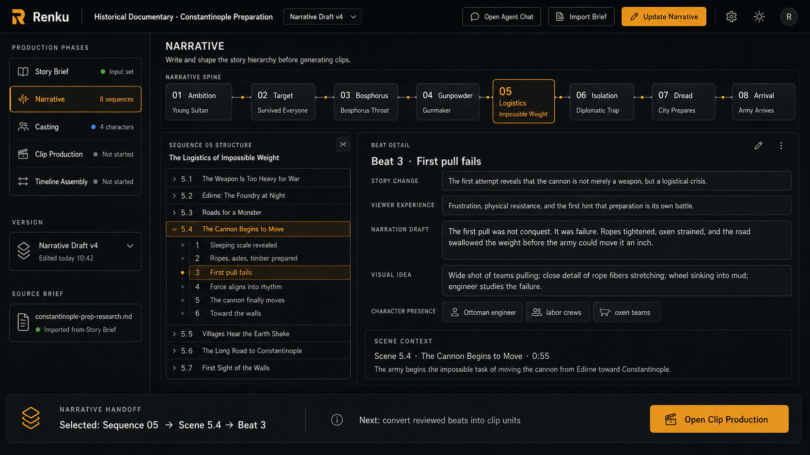
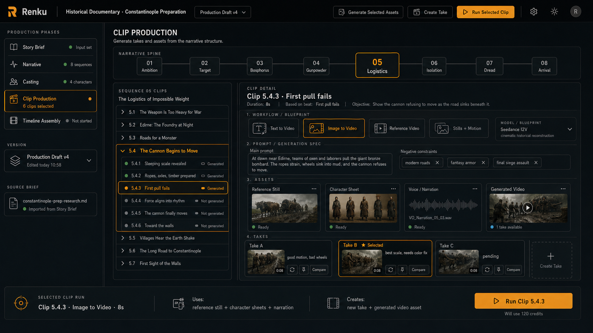

# Renku Movie Production Interface Concept

Date: 2026-04-30

This note captures the current conceptual UI direction for a higher-level Renku movie production app.

The goal is to move the primary user experience away from low-level blueprint execution concepts such as producers, layers, clips, and technical graphs, and toward the mental model of someone producing a film.

The examples here use a historical documentary about the preparation of the Siege of Constantinople, but the structure should apply to other movie genres as well.

## Core Product Direction

Renku should model movie generation as a production workflow.

The app should help the user:

- define the film intent,
- shape the narrative,
- define characters and recurring assets,
- turn narrative beats into generated clips,
- create and compare takes,
- assemble the final timeline.

Technical blueprint details should still exist, but they should be secondary. The primary interface should answer:

- What story are we making?
- Where are we in the production process?
- Which sequence, scene, beat, or clip are we working on?
- What text, characters, prompts, assets, and takes belong to that selected item?
- What is the next concrete production action?

## Production Phases

The current high-level production phases are:

1. **Story Brief**
   - Initial input stage.
   - This is where external research or a markdown dossier is imported.
   - Research itself does not need to be represented as a production phase inside Renku.

2. **Narrative**
   - Story structure and text.
   - Includes narrative spine, sequences, scenes, and beats.
   - This is likely where an AI coding/agent tool such as Codex or Claude Code can help through an iterative back-and-forth process.
   - Renku’s job is to visualize and structure the narrative as it is created.

3. **Casting**
   - Character and recurring entity definition.
   - Describes characters, experts, narrators, or recurring historical figures.
   - Produces character sheets, reference images, voices, and other reusable assets.
   - The narrative spine does not need to appear in this phase.

4. **Clip Production**
   - Replaces the earlier working term “Clip Realization.”
   - Hands-on generation phase.
   - Turns beats into one-to-one clip units for simplicity.
   - Lets the user choose generation workflows/blueprints, create assets, generate multiple takes, compare them, and select usable results.

5. **Timeline Assembly**
   - Final ordering and composition.
   - Combines generated clips, narration, music, subtitles, graphics, maps, and transitions.

## Shared Navigation Model

The **Narrative** and **Clip Production** sections should share the same top-level story anchor:

> Narrative Spine → Selected Sequence → Scene/Beat or Scene/Clip navigation → Detail panel

The narrative spine is a horizontal sequence navigation strip at the top of the main workspace.

For the Constantinople documentary example:

```text
01 Ambition
02 Target
03 Bosphorus
04 Gunpowder
05 Logistics
06 Isolation
07 Dread
08 Arrival
```

This replaces the need for a separate large sequence list. The selected sequence is chosen directly from the spine.

Under the spine, the workspace uses two main areas:

- a narrower left panel for the selected sequence’s structure,
- a larger right panel for the selected item’s details.

## Narrative Section

The Narrative section should be text-first.

It should help the user understand and edit:

- sequence purpose,
- scene summaries,
- beats,
- narration drafts,
- visual ideas,
- relevant characters.

It should not be cluttered with production controls such as approvals, generation statuses, or technical execution details.

### Narrative Layout

```text
Production phases rail
  Story Brief
  Narrative
  Casting
  Clip Production
  Timeline Assembly

Main workspace
  Narrative spine
  Selected sequence structure
    scenes
    collapsible beats under scenes
  Detail panel
    selected scene or beat text
```

### Narrative Mockup



## Clip Production Section

The Clip Production section should preserve the same story navigation structure, but change the detail surface from narrative text to hands-on asset generation.

In this mode:

- scenes remain the parent structure,
- clips appear under scenes,
- clips map one-to-one with beats for ease of understanding,
- the detail panel focuses on workflow choice, prompt package, assets, and takes.

The user should be able to:

- choose a generation workflow or blueprint,
- edit the prompt/generation spec,
- inspect required inputs and generated assets,
- generate a new take,
- compare multiple takes,
- pick or pin the preferred take.

### Clip Production Layout

```text
Production phases rail
  Story Brief
  Narrative
  Casting
  Clip Production
  Timeline Assembly

Main workspace
  Narrative spine
  Selected sequence clips
    scenes
    collapsible clips under scenes
  Detail panel
    selected clip brief
    workflow/blueprint selector
    prompt editor
    assets
    takes
```

### Clip Production Mockup



## Important UI Decisions Captured So Far

- Research should not be a production phase. It is external context imported into Story Brief.
- Story Brief should remain a first-class phase because it is where the initial input enters the app.
- Narrative Spine through Beat Sheet should be collapsed into the **Narrative** phase.
- Casting should be its own phase under the movie production workflow.
- “Clip Realization” should be renamed. Current preferred name: **Clip Production**.
- The top narrative spine should appear in Narrative and Clip Production, but not Casting.
- The narrative spine should serve as sequence navigation, so a separate sequence list is redundant.
- Under the spine, use a narrow scene navigation panel with collapsible beats or clips.
- The right detail panel should change by phase:
  - Narrative: story text, narration, scene/beat detail, characters.
  - Clip Production: workflows, prompts, assets, takes, generation actions.
- Avoid invented approval, readiness, and review mechanics unless they become explicit product requirements.
- Avoid exposing low-level blueprint graphs, layers, producers, or execution DAGs on these primary movie-production screens.

## Open Architecture Questions

- What data model represents the shared narrative hierarchy?
- Should beats and clips be separate entities with explicit links, or should first-party movie workflows initially enforce a one-to-one mapping?
- How should Story Brief import structured markdown into the narrative model?
- How should Casting assets be referenced by Narrative and Clip Production without relying on naming patterns?
- How should Clip Production map user-facing workflow choices to concrete blueprints and producers?
- What metadata does a blueprint need to expose so the UI can present workflows, required inputs, generated assets, and takes generically?
- Where should technical graph/debug views live for advanced users?
